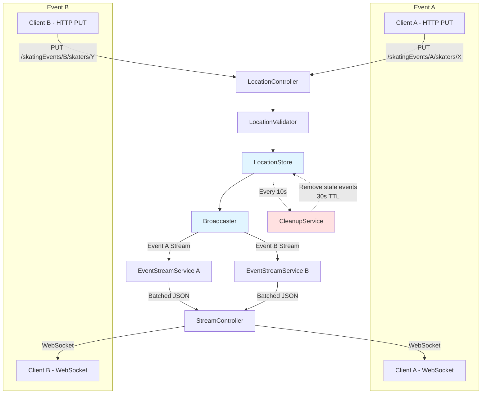

# Skatemap Live - Event-Based Location Streaming Prototype

Real-time location streaming for organised skating sessions, built with Scala and WebSockets.

## Overview

Skatemap Live is an event-based location streaming system where:

- **Events represent organised skating sessions** - Each event is identified by a UUID (e.g., `550e8400-e29b-41d4-a716-446655440000`)
- **Skaters join events and send location updates** - Skaters publish their GPS coordinates to a specific event via HTTP PUT
- **Viewers watch specific events via WebSocket** - Each viewer connects to one event and receives real-time location updates for that event only
- **Complete event isolation** - No data leakage between events. Skaters in event A never see skaters in event B
- **Automatic cleanup** - Events expire 30 seconds after the last location update. A background job runs every 10 seconds to remove stale data

This architecture enables multiple concurrent skating sessions without interference, with automatic resource cleanup for abandoned events.

### Why Event-Based?

Traditional location streaming systems use a global feed where all skaters see everyone else. This doesn't match real-world skating: organised group rides are separate events, not a single massive session.

**Benefits of event isolation:**
- **Privacy** - Skaters only share location with their intended group
- **Scalability** - Each event has independent resources; one busy event doesn't slow down others
- **Simplicity** - No authentication needed; knowing the event UUID grants access (like a shared document link)
- **Auto-cleanup** - Abandoned events disappear automatically; no manual deletion required
- **Multi-tenancy** - Same infrastructure supports unlimited concurrent events without configuration

## Quick Start

Get the prototype running in under 5 minutes:

### Prerequisites

- Java 11 or higher
- sbt 1.11+
- Scala 2.13.16 (managed by sbt)

### Build and Run

```bash
git clone https://github.com/SkatemapApp/skatemap-live.git
cd skatemap-live
sbt compile
sbt run
```

Server starts on `http://localhost:9000`

### Verify It Works

Open the HTML viewer:
```
http://localhost:9000/assets/viewer.html
```

Enter an event ID (e.g., `event-123`) and click Connect. In another terminal, send a location update:

```bash
curl -X PUT http://localhost:9000/skatingEvents/event-123/skaters/alice \
  -H "Content-Type: application/json" \
  -d '{"coordinates": [-0.1278, 51.5074]}'
```

You should see Alice's location appear in the viewer immediately.

## API Reference

### 1. Update Skater Location

Publish a location update for a skater in a specific event.

**Endpoint:**
```
PUT /skatingEvents/{eventId}/skaters/{skaterId}
Content-Type: application/json

Body: {"coordinates": [longitude, latitude]}
```

**Example:**
```bash
curl -X PUT http://localhost:9000/skatingEvents/550e8400-e29b-41d4-a716-446655440000/skaters/550e8400-e29b-41d4-a716-446655440001 \
  -H "Content-Type: application/json" \
  -d '{"coordinates": [-0.1278, 51.5074]}'
```

**Response:**
```
202 Accepted
```

**Notes:**
- Both `eventId` and `skaterId` must be valid UUIDs
- Coordinates use GeoJSON order: `[longitude, latitude]` (not latitude first!)
- Longitude range: -180 to 180
- Latitude range: -90 to 90
- Empty 202 response indicates successful acceptance
- Input format uses array `[lon, lat]`, but WebSocket output uses separate fields

### 2. Stream Event Locations (WebSocket)

Subscribe to real-time location updates for a specific event.

**Endpoint:**
```
GET /skatingEvents/{eventId}/stream
Upgrade: websocket
```

**Browser Test:**
Open `http://localhost:9000/assets/viewer.html` and enter your event ID.

**Message Format:**
```json
{
  "locations": [
    {
      "skaterId": "550e8400-e29b-41d4-a716-446655440001",
      "latitude": 51.5074,
      "longitude": -0.1278,
      "timestamp": 1633024800000
    }
  ],
  "serverTime": 1633024800123
}
```

**Notes:**
- `latitude` and `longitude` are separate fields (not an array)
- `timestamp` in milliseconds since Unix epoch (location time)
- `serverTime` in milliseconds since Unix epoch (batch creation time)

**Batching Behaviour:**
- Messages sent every 500ms OR when 100 locations accumulate (whichever comes first)
- Reduces WebSocket overhead for high-frequency updates

**Example with websocat:**
```bash
websocat ws://localhost:9000/skatingEvents/event-123/stream
```

### 3. Health Check

Simple endpoint to verify the service is running.

**Endpoint:**
```
GET /health
```

**Response:**
```
200 OK
```

**Example:**
```bash
curl http://localhost:9000/health
```

## Testing Event Isolation

Demonstrate complete isolation between events using multiple terminals:

**Terminal 1 - Start Event A (event-123):**
```bash
while true; do
  curl -X PUT http://localhost:9000/skatingEvents/event-123/skaters/alice \
    -H "Content-Type: application/json" \
    -d '{"coordinates": [-0.1278, 51.5074]}'
  sleep 1
done
```

**Terminal 2 - Start Event B (event-456):**
```bash
while true; do
  curl -X PUT http://localhost:9000/skatingEvents/event-456/skaters/bob \
    -H "Content-Type: application/json" \
    -d '{"coordinates": [-74.0060, 40.7128]}'
  sleep 1
done
```

**Terminal 3 - Watch Event A:**
1. Open browser to `http://localhost:9000/assets/viewer.html`
2. Enter event ID: `event-123`
3. Click Connect
4. Verify: Only Alice appears (London coordinates)

**Terminal 4 - Watch Event B:**
1. Open browser to `http://localhost:9000/assets/viewer.html`
2. Enter event ID: `event-456`
3. Click Connect
4. Verify: Only Bob appears (New York coordinates)

**Result:** Alice and Bob never see each other's locations. Events are completely isolated.

**Stop both curl loops and wait 30 seconds:**
- Events automatically expire and are cleaned up
- Memory is freed for both events
- Reconnecting to either event shows empty state

## Architecture



### Key Architectural Decisions

**Event-Scoped Streams:**
- Each event has its own BroadcastHub (Pekko Streams)
- Events are created implicitly when first location is published
- Streams remain active until cleanup removes the event

**In-Memory Storage with TTL:**
- `InMemoryLocationStore` uses `TrieMap[EventId, TrieMap[SkaterId, (Location, Timestamp)]]`
- Nested structure provides event isolation at the data layer
- 30-second TTL per location, checked every 10 seconds
- When all skaters in an event expire, the event is removed

**Backpressure Handling:**
- Pekko Streams provides automatic backpressure
- WebSocket clients that can't keep up are dropped (overflow strategy: DropHead)
- Fast clients aren't slowed down by slow clients

**Technology Stack:**
- Play Framework 3.x (HTTP + WebSocket handling)
- Apache Pekko Streams (Akka fork, post-Lightbend license change)
- Scala 2.13.16 with functional error handling (Either, no exceptions)
- Guice dependency injection

## Testing

### Run All Tests
```bash
sbt test
```

### Run Tests with Coverage
```bash
sbt coverage test coverageReport
```

Coverage report generated at: `target/scala-2.13/scoverage-report/index.html`

### Current Status
- **100% statement coverage** maintained across all code
- Coverage enforcement enabled (build fails below 100%)
- Test suites cover:
  - Unit tests for domain logic and validation
  - Integration tests for HTTP endpoints
  - WebSocket end-to-end tests
  - Concurrent event isolation tests

### Test Files
- Unit: `src/test/scala/skatemap/core/`
- API: `src/test/scala/skatemap/api/`
- Integration: `src/test/scala/skatemap/integration/`

## Troubleshooting

### "Route not found" or 404 errors
**Cause:** Server not running or wrong port
**Solution:** Ensure `sbt run` shows "Listening for HTTP on /[0:0:0:0:0:0:0:0]:9000"

### "Connection refused" on WebSocket
**Cause:** Protocol mismatch (using `wss://` instead of `ws://`)
**Solution:** Use `ws://localhost:9000/...` for local development

### No locations showing in viewer
**Cause:** Event may have expired (30s TTL)
**Solution:** Send a fresh location update to recreate the event

### Old locations appearing after expected expiry
**Cause:** Cleanup runs every 10 seconds, not real-time
**Solution:** Wait up to 40 seconds total (30s TTL + 10s cleanup interval)

### WebSocket disconnects immediately
**Cause:** Invalid event ID (not a UUID)
**Solution:** Use valid UUID format for event IDs

### Build fails with coverage error
**Cause:** New code added without tests
**Solution:** Add tests to maintain 100% coverage or fix uncovered branches

## Technology Stack

- **Scala** 2.13.16
- **Play Framework** 3.x (HTTP and WebSocket server)
- **Apache Pekko Streams** 1.1.2 (streaming, backpressure, broadcast)
- **WebSockets** (real-time bidirectional communication)
- **ScalaTest** + **Mockito** (testing framework)
- **Scoverage** (code coverage analysis)
- **WartRemover** (compile-time linting)

## Configuration

Default configuration values:

| Setting | Value | Location |
|---------|-------|----------|
| Port | 9000 | Default Play port |
| Location TTL | 30 seconds | `InMemoryLocationStore.scala:13` |
| Cleanup Interval | 10 seconds | `CleanupService.scala:20` |
| Batch Duration | 500ms | `StreamConfig.scala:11` |
| Max Batch Size | 100 locations | `StreamConfig.scala:11` |

These are currently hardcoded. Future versions may expose via `application.conf`.

## Development

### Build Commands

```bash
sbt compile          # Compile all sources
sbt run              # Start development server (hot reload enabled)
sbt test             # Run test suite
sbt clean            # Clean build artifacts
sbt ciBuild          # Run full CI pipeline (clean, format check, coverage, test)
```

### Code Quality

Quality is enforced at compile time:

- **WartRemover:** Catches common Scala pitfalls (null, var, return, exceptions)
- **Scoverage:** Enforces 100% statement coverage (build fails otherwise)
- **Scalafmt:** Code formatting (check with `sbt scalafmtCheckAll`, fix with `sbt scalafmt`)
- **Compiler Warnings:** Unused imports/variables treated as errors (`-Xfatal-warnings`)

### Functional Programming Style

- No exceptions thrown (use `Either[ValidationError, T]`)
- No null (use `Option`)
- Pure functions in `core/` domain layer
- Side effects isolated to `infra/` and controllers


### Cleanup Service

The automatic cleanup service removes stale location data from memory. Configure cleanup intervals in `application.conf`:

```hocon
skatemap {
  cleanup {
    initialDelaySeconds = 10  # Delay before first cleanup run (in seconds)
    intervalSeconds = 10      # Interval between cleanup runs (in seconds)
  }
}
```

**Default Values:**
- `initialDelaySeconds`: 10 seconds
- `intervalSeconds`: 10 seconds

**Environment-Specific Examples:**

Development (frequent cleanup for faster testing):
```hocon
skatemap.cleanup {
  initialDelaySeconds = 5
  intervalSeconds = 5
}
```

Production (less frequent to reduce overhead):
```hocon
skatemap.cleanup {
  initialDelaySeconds = 30
  intervalSeconds = 30
}
```

Test (immediate cleanup):
```hocon
skatemap.cleanup {
  initialDelaySeconds = 1
  intervalSeconds = 1
}
```

**Notes:**
- Both values must be positive integers (> 0)
- Invalid or negative values automatically fall back to defaults (10 seconds)
- The cleanup service removes location data older than 30 seconds (configurable via `InMemoryLocationStore.maxAge`)

**Monitoring:**
- Cleanup operations are logged at `INFO` level with removal counts
- Errors are logged at `ERROR` level with stack traces
- Service initialization and shutdown are logged at `INFO` level
- Check logs for `CleanupService` to monitor cleanup behaviour
