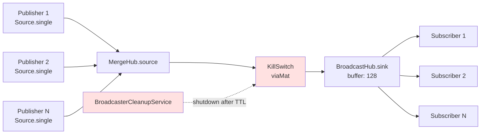
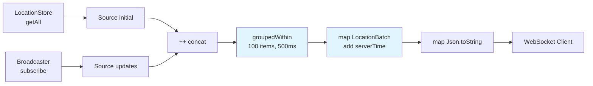

# Pekko Streams Topology

This document provides detailed stream graph diagrams for the Pekko Streams implementations in Skatemap Live. It complements the high-level architecture diagram in the [API README](/services/api/README.md) by showing the internal structure of stream operators.

## Overview

The system uses two primary stream graphs:

1. **InMemoryBroadcaster Hub** - Publish/subscribe pattern with graceful shutdown
2. **EventStreamService Pipeline** - WebSocket streaming with initial snapshot and batching

Both streams leverage Pekko Streams' built-in hub operators (MergeHub and BroadcastHub) to enable dynamic publishers and subscribers without materialising new streams for each client.

## InMemoryBroadcaster Hub (Publish/Subscribe)

The broadcaster uses a MergeHub → KillSwitch → BroadcastHub pattern to create a reusable pub/sub hub per event.



### Stream Operators

**MergeHub.source**
- Accepts multiple publishers dynamically
- Each `publish()` call creates a `Source.single(location)` and runs it to the hub's sink
- Merges all incoming locations into a single stream
- No need to rematerialise the graph when publishers come and go

**viaMat(KillSwitch)**
- Enables graceful shutdown of the entire hub
- `BroadcasterCleanupService` calls `killSwitch.shutdown()` after TTL expires
- Prevents Pekko Streams BroadcastHub memory leak (see [issue #142](https://github.com/SkatemapApp/skatemap-live/issues/142))
- Critical for cleanup - without it, materialised streams persist in ActorSystem even after removal from registry

**BroadcastHub.sink**
- Broadcasts incoming locations to all subscribers
- Buffer size: 128 (configurable via `skatemap.hub.bufferSize`)
- Each `subscribe()` call returns the hub's source
- Subscribers see all locations published after they subscribe (not before)

### Materialised Values

The stream materialises to `((Sink[Location, NotUsed], UniqueKillSwitch), Source[Location, NotUsed])`:

- **Sink**: Used by `publish()` to send locations into the hub
- **KillSwitch**: Used by cleanup service to shut down the hub
- **Source**: Used by `subscribe()` to receive locations from the hub

These values are stored in `HubData` and kept in a `TrieMap[String, HubData]` registry indexed by event ID.

### Code Reference

Implementation: `/services/api/src/main/scala/skatemap/core/InMemoryBroadcaster.scala:31-35`

```scala
val ((sink, killSwitch), source) = MergeHub
  .source[Location]
  .viaMat(KillSwitches.single)(Keep.both)
  .toMat(BroadcastHub.sink[Location](bufferSize = config.bufferSize))(Keep.both)
  .run()
```

## EventStreamService Pipeline (WebSocket Streaming)

The event stream concatenates an initial snapshot with live updates, then batches and serialises them for WebSocket delivery.



### Stream Stages

**Source(initial)**
- Retrieves current locations from `LocationStore.getAll(eventId)`
- Converts to list and wraps in `Source`
- Sends snapshot of all existing locations when client connects
- Completes immediately after sending all current data

**Source(updates)**
- Subscribes to `Broadcaster.subscribe(eventId)` for live updates
- Returns the BroadcastHub source for this event
- Streams all locations published after subscription
- Never completes (infinite stream until WebSocket disconnects)

**++ (concat)**
- Concatenates initial source with updates source
- Ensures clients receive snapshot first, then live updates
- Ordering guarantee: all initial locations before any live updates
- No overlap or duplicate data between sources

**groupedWithin(100, 500ms)**
- Batches locations to reduce WebSocket message overhead
- Emits when either limit is reached (whichever comes first):
  - 100 locations accumulated (configurable via `skatemap.stream.batchSize`)
  - 500 milliseconds elapsed (configurable via `skatemap.stream.batchIntervalMillis`)
- Trade-off: Higher batch size = better throughput, higher latency

**map(LocationBatch)**
- Wraps batch of locations with server timestamp
- Timestamp from `clock.millis()` - when batch was created, not when locations were published
- Allows clients to detect processing delays

**map(Json.toString)**
- Serialises `LocationBatch` to JSON string using Play JSON
- Output format:
  ```json
  {
    "locations": [
      {"skaterId": "...", "latitude": 51.5074, "longitude": -0.1278, "timestamp": 1633024800000}
    ],
    "serverTime": 1633024800123
  }
  ```
- WebSocket requires `String` messages, not objects

### Code Reference

Implementation: `/services/api/src/main/scala/skatemap/core/EventStreamService.scala:20-31`

```scala
val initial: Source[Location, NotUsed] =
  Source(store.getAll(eventId).values.toList)

val updates: Source[Location, NotUsed] =
  broadcaster.subscribe(eventId)

(initial ++ updates)
  .groupedWithin(config.batchSize, config.batchInterval)
  .map(batch => LocationBatch(batch.toList, clock.millis()))
  .map(batch => Json.toJson(batch).toString)
```

## Stream Lifecycle

### Hub Creation

Hubs are created lazily on first access (publish or subscribe):

1. Client publishes location → `getOrCreateHub(eventId)` called
2. Hub doesn't exist → Create MergeHub → KillSwitch → BroadcastHub graph
3. Materialise and store `(sink, source, killSwitch)` in registry
4. Update `lastAccessed` timestamp

Subsequent publishes and subscribes reuse the existing hub.

### Hub Cleanup

`BroadcasterCleanupService` runs every 60 seconds (configurable via `skatemap.hub.cleanupIntervalSeconds`):

1. Find hubs where `lastAccessed < now - TTL` (default TTL: 300 seconds)
2. Call `killSwitch.shutdown()` to stop the stream
3. Remove hub from registry

The KillSwitch is essential - simply removing the hub from the registry would leak the BroadcastHub stream. See [issue #142](https://github.com/SkatemapApp/skatemap-live/issues/142) for details on why this pattern is necessary.

### Why KillSwitch is Required

Pekko Streams BroadcastHub holds internal state that prevents garbage collection even when all external references are removed. Without explicitly shutting down the stream via KillSwitch, the hub's internal resources remain allocated indefinitely, causing memory leaks.

The KillSwitch pattern ensures:
- Stream is gracefully terminated before removal
- All subscribers receive completion signal
- Internal BroadcastHub resources are released
- Memory is freed for garbage collection

See [issue #142](https://github.com/SkatemapApp/skatemap-live/issues/142) for the full investigation and fix rationale.

## Configuration Impact on Streams

### Stream Batching Configuration

**`skatemap.stream.batchSize`** (default: 100)
- Controls max items in `groupedWithin` operator
- Higher values: Better throughput (fewer WebSocket messages), higher latency
- Lower values: Lower latency (more frequent updates), higher overhead

**`skatemap.stream.batchIntervalMillis`** (default: 500)
- Controls max time in `groupedWithin` operator
- Higher values: Batches fill before sending, better for high-volume events
- Lower values: Messages sent more frequently, better for low-activity events

### Hub Configuration

**`skatemap.hub.bufferSize`** (default: 128)
- BroadcastHub buffer size for each event hub
- If subscribers can't keep up, buffer prevents backpressure to publishers
- When buffer full, oldest messages are dropped

**`skatemap.hub.ttlSeconds`** (default: 300)
- How long unused hubs are kept before cleanup
- Balances memory usage with connection patterns
- Should be longer than typical reconnection time

**`skatemap.hub.cleanupIntervalSeconds`** (default: 60)
- How often cleanup service runs
- Should be less than TTL to ensure timely removal
- Too frequent: unnecessary overhead; too infrequent: delayed cleanup

## See Also

- [API README](/services/api/README.md) - High-level architecture diagram
- [Issue #142](https://github.com/SkatemapApp/skatemap-live/issues/142) - Why KillSwitch is needed for BroadcastHub cleanup
- [ADR 0003](/docs/adr/0003-jvm-profiling-tooling.md) - Profiling tools used to diagnose memory leaks
- [Pekko Streams Documentation](https://pekko.apache.org/docs/pekko/current/stream/) - General stream concepts
