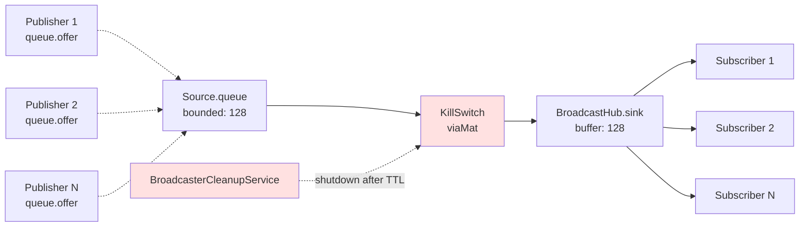
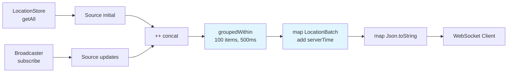

# Pekko Streams Topology

This document provides detailed stream graph diagrams for the Pekko Streams implementations in Skatemap Live. It complements the high-level architecture diagram in the [API README](/services/api/README.md) by showing the internal structure of stream operators.

## Overview

The system uses two primary stream graphs:

1. **InMemoryBroadcaster Hub** - Publish/subscribe pattern with graceful shutdown
2. **EventStreamService Pipeline** - WebSocket streaming with initial snapshot and batching

Both streams leverage Pekko Streams' built-in hub operators (Source.queue and BroadcastHub) to enable dynamic publishers and subscribers without materialising new streams for each client.

## InMemoryBroadcaster Hub (Publish/Subscribe)

The broadcaster uses a Source.queue → KillSwitch → BroadcastHub pattern to create a reusable pub/sub hub per event.

The broadcaster materialises a single stream graph per event, with a bounded queue that accepts location updates via `offer()`. This eliminates the memory leak from the previous MergeHub approach where each `publish()` call materialised a new `Source.single(location)` stream.



### Stream Operators

**Source.queue**
- Creates a bounded source queue with buffer size 128 (configurable via `skatemap.hub.bufferSize`)
- Uses `OverflowStrategy.dropHead` - when buffer is full, oldest message is automatically dropped to make room for new message
- Publishers call `queue.offer(location)` to enqueue locations (returns `Future[QueueOfferResult]`)
- With `dropHead` strategy, `offer()` always returns `Enqueued` (drops are handled internally by Pekko)
- Single materialisation - the queue persists for the lifetime of the hub
- Eliminates memory leak from the previous MergeHub approach where each `publish()` materialised a new stream

**viaMat(KillSwitch)**
- Enables graceful shutdown of the entire hub
- `BroadcasterCleanupService` calls `killSwitch.shutdown()` after TTL expires
- Prevents Pekko Streams BroadcastHub memory leak by enabling graceful shutdown (see [issue #142](https://github.com/SkatemapApp/skatemap-live/issues/142))
- Critical for cleanup - without it, materialised streams persist in ActorSystem even after removal from registry
- On shutdown, `queue.complete()` is called automatically by KillSwitch, preventing further offers

**BroadcastHub.sink**
- Broadcasts incoming locations to all subscribers
- Buffer size: 128 (configurable via `skatemap.hub.bufferSize`)
- Each `subscribe()` call returns the hub's source
- Subscribers see all locations published after they subscribe (not before)

### Materialised Values

The stream materialises to `((SourceQueueWithComplete[Location], UniqueKillSwitch), Source[Location, NotUsed])`:

- **SourceQueueWithComplete**: Used by `publish()` to offer locations into the hub via `queue.offer(location)` (returns `Future[QueueOfferResult]`)
- **KillSwitch**: Used by cleanup service to shut down the hub
- **Source**: Used by `subscribe()` to receive locations from the hub

These values are stored in `HubData` and kept in a `TrieMap[String, HubData]` registry indexed by event ID.

**Error Handling**: The `publish()` method returns `Future[Unit]` and handles errors asynchronously:
- `Enqueued`: Location successfully queued (normal case with `dropHead` strategy)
- `Dropped`: Will not occur with `dropHead` strategy (overflow handled internally)
- `QueueClosed`: Hub shut down - warning logged (rare edge case)
- `Failure(cause)`: Stream stage failure - error logged with cause exception (rare edge case)
- `StreamDetachedException`: Queue closed or stream failed - error logged ("Failed to offer location")

The `dropHead` strategy ensures publishers always succeed even when buffer is full, trading stale data for fresh data. This decouples publishers from subscribers - publishers don't need active subscribers to succeed.

**Critical consideration:** When using `dropHead` with BroadcastHub, messages can accumulate in stream graph internals if no subscribers are draining the hub. The documented pattern is to attach `Sink.ignore` as a permanent draining subscriber to prevent accumulation ([Pekko docs](https://pekko.apache.org/docs/pekko/current/stream/stream-dynamic.html)). Without this, memory leaks can occur in scenarios with no active subscribers.

### Code Reference

Implementation: `/services/api/src/main/scala/skatemap/core/InMemoryBroadcaster.scala:33-38`

```scala
val ((queue, killSwitch), source) = Source
  .queue[Location](config.bufferSize, OverflowStrategy.dropHead)
  .viaMat(KillSwitches.single)(Keep.both)
  .toMat(BroadcastHub.sink[Location](bufferSize = config.bufferSize))(Keep.both)
  .run()

source.runWith(Sink.ignore)
```

**Note:** The `Sink.ignore` attachment is essential to prevent memory accumulation when no real subscribers are present. It continuously drains the BroadcastHub, ensuring messages don't accumulate in internal buffers. When real subscribers connect, the BroadcastHub broadcasts to both `Sink.ignore` and real subscribers.

**Note on memory retention:** Memory acquired during the first load test after deployment (typically ~50 MB) is retained indefinitely. This is normal JVM warmup behaviour (JIT code cache + metaspace class loading), not an application memory leak. Subsequent load tests do not cause additional retention — the pattern is one-time warmup (x+y), not cumulative (x+y+y). See issue #166 and PR #178 for investigation details.

Publishing to the hub (`/services/api/src/main/scala/skatemap/core/InMemoryBroadcaster.scala:49-58`):

```scala
def publish(eventId: String, location: Location): Future[Unit] = {
  val hubData = getOrCreateHub(eventId)
  hubData.queue.offer(location).map {
    case QueueOfferResult.Enqueued    => ()
    case QueueOfferResult.Dropped     => logger.warn("Location dropped for event {} due to queue overflow", eventId)
    case QueueOfferResult.QueueClosed => logger.warn("Location dropped for event {} because queue closed", eventId)
    case QueueOfferResult.Failure(cause) => logger.error("Failed to offer location for event {}", eventId, cause)
  }.recover {
    case _: StreamDetachedException =>
      logger.error("Failed to offer location for event {}", eventId)
  }
}
```

## EventStreamService Pipeline (WebSocket Streaming)

The event stream concatenates an initial snapshot with live updates, then batches and serialises them for WebSocket delivery.



### Stream Stages

**Source(initial)**
- Retrieves current locations from `LocationStore.getAll(eventId)`
- Converts to list and wraps in `Source`
- Sends snapshot of all existing locations when client connects
- Completes immediately after sending all current data

**Source(updates)**
- Subscribes to `Broadcaster.subscribe(eventId)` for live updates
- Returns the BroadcastHub source for this event
- Streams all locations published after subscription
- Never completes (infinite stream until WebSocket disconnects)

**++ (concat)**
- Concatenates initial source with updates source
- Ensures clients receive snapshot first, then live updates
- Ordering guarantee: all initial locations before any live updates
- No overlap or duplicate data between sources

**groupedWithin(100, 500ms)**
- Batches locations to reduce WebSocket message overhead
- Emits when either limit is reached (whichever comes first):
  - 100 locations accumulated (configurable via `skatemap.stream.batchSize`)
  - 500 milliseconds elapsed (configurable via `skatemap.stream.batchIntervalMillis`)
- Trade-off: Higher batch size = better throughput, higher latency

**map(LocationBatch)**
- Wraps batch of locations with server timestamp
- Timestamp from `clock.millis()` - when batch was created, not when locations were published
- Allows clients to detect processing delays

**map(Json.toString)**
- Serialises `LocationBatch` to JSON string using Play JSON
- Output format:
  ```json
  {
    "locations": [
      {"skaterId": "...", "latitude": 51.5074, "longitude": -0.1278, "timestamp": 1633024800000}
    ],
    "serverTime": 1633024800123
  }
  ```
- WebSocket requires `String` messages, not objects

### Code Reference

Implementation: `/services/api/src/main/scala/skatemap/core/EventStreamService.scala:20-31`

```scala
val initial: Source[Location, NotUsed] =
  Source(store.getAll(eventId).values.toList)

val updates: Source[Location, NotUsed] =
  broadcaster.subscribe(eventId)

(initial ++ updates)
  .groupedWithin(config.batchSize, config.batchInterval)
  .map(batch => LocationBatch(batch.toList, clock.millis()))
  .map(batch => Json.toJson(batch).toString)
```

## Stream Lifecycle

### Hub Creation

Hubs are created lazily on first access (publish or subscribe):

1. Client publishes location → `getOrCreateHub(eventId)` called
2. Hub doesn't exist → Create Source.queue → KillSwitch → BroadcastHub graph
3. Materialise and store `(queue, source, killSwitch)` in registry
4. Update `lastAccessed` timestamp

Subsequent publishes and subscribes reuse the existing hub.

### Hub Cleanup

`BroadcasterCleanupService` runs every 60 seconds (configurable via `skatemap.hub.cleanupIntervalSeconds`):

1. Find hubs where `lastAccessed < now - TTL` (default TTL: 300 seconds)
2. Call `killSwitch.shutdown()` to stop the stream
3. Remove hub from registry

The KillSwitch is essential - simply removing the hub from the registry would leak the BroadcastHub stream. See [issue #142](https://github.com/SkatemapApp/skatemap-live/issues/142) for details on why this pattern is necessary.

### Why KillSwitch is Required

Pekko Streams BroadcastHub holds internal state that prevents garbage collection even when all external references are removed. Without explicitly shutting down the stream via KillSwitch, the hub's internal resources remain allocated indefinitely, causing memory leaks.

The KillSwitch pattern ensures:
- Stream is gracefully terminated before removal
- All subscribers receive completion signal
- Internal BroadcastHub resources are released
- Memory is freed for garbage collection

See [issue #142](https://github.com/SkatemapApp/skatemap-live/issues/142) for the full investigation and fix rationale.

## Configuration Impact on Streams

### Stream Batching Configuration

**`skatemap.stream.batchSize`** (default: 100)
- Controls max items in `groupedWithin` operator
- Higher values: Better throughput (fewer WebSocket messages), higher latency
- Lower values: Lower latency (more frequent updates), higher overhead

**`skatemap.stream.batchIntervalMillis`** (default: 500)
- Controls max time in `groupedWithin` operator
- Higher values: Batches fill before sending, better for high-volume events
- Lower values: Messages sent more frequently, better for low-activity events

### Hub Configuration

**`skatemap.hub.bufferSize`** (default: 128)
- Configures buffer size for BOTH the source queue AND the BroadcastHub
- Source.queue buffer: Uses `OverflowStrategy.dropHead` - when full, oldest message is automatically dropped to make room for new message
- BroadcastHub buffer: If subscribers lag and buffer fills, oldest messages are dropped
- The `dropHead` strategy ensures fresh location data takes priority over stale data
- Publishers always succeed even without active subscribers (no publisher/subscriber coupling)
- **Important:** `dropHead` deliberately ignores backpressure from downstream (documented Pekko behaviour)
  - When BroadcastHub has no subscribers, it attempts to apply backpressure
  - dropHead defeats this backpressure mechanism, continuing to emit messages
  - Without a draining subscriber, messages can accumulate in stream graph internals
  - **Solution:** Attach `Sink.ignore` to continuously drain when no real subscribers (see [Pekko docs](https://pekko.apache.org/docs/pekko/current/stream/stream-dynamic.html))
  - This pattern ensures messages are always consumed, preventing accumulation

**`skatemap.hub.ttlSeconds`** (default: 300)
- How long unused hubs are kept before cleanup
- Balances memory usage with connection patterns
- Should be longer than typical reconnection time

**`skatemap.hub.cleanupIntervalSeconds`** (default: 60)
- How often cleanup service runs
- Should be less than TTL to ensure timely removal
- Too frequent: unnecessary overhead; too infrequent: delayed cleanup

## See Also

- [API README](/services/api/README.md) - High-level architecture diagram
- [Issue #138](https://github.com/SkatemapApp/skatemap-live/issues/138) - Memory leak investigation: dropHead + BroadcastHub backpressure conflict
- [Issue #142](https://github.com/SkatemapApp/skatemap-live/issues/142) - Why KillSwitch is needed for BroadcastHub cleanup
- [Pull Request #148](https://github.com/SkatemapApp/skatemap-live/pull/148) - Migration from MergeHub to Source.queue to fix publish memory leak
- [Pull Request #169](https://github.com/SkatemapApp/skatemap-live/pull/169) - dropHead fix that inadvertently worsened memory leak
- [dropHead Fix Results](/docs/profiling/results/drophead-fix-results-20260118.md) - Railway validation showing backpressure conflict
- [ADR 0003](/docs/adr/0003-jvm-profiling-tooling.md) - Profiling tools used to diagnose memory leaks
- [Pekko Streams Documentation](https://pekko.apache.org/docs/pekko/current/stream/) - General stream concepts
- [Pekko BroadcastHub with Sink.ignore pattern](https://pekko.apache.org/docs/pekko/current/stream/stream-dynamic.html) - Documented pattern for draining hubs without subscribers
