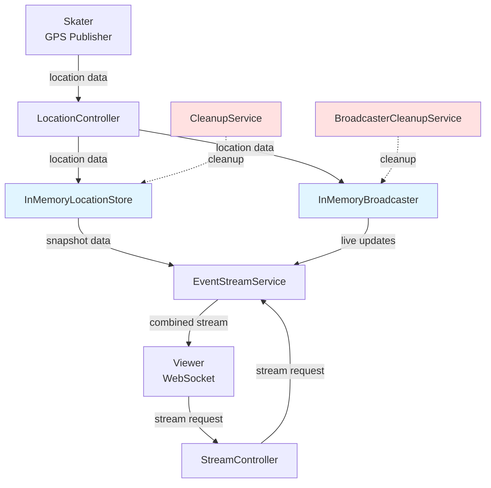
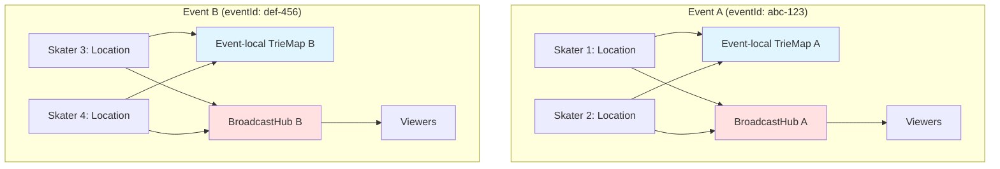
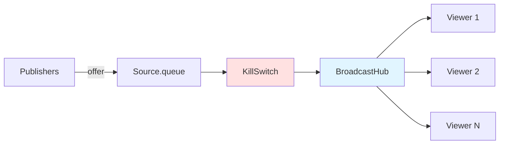
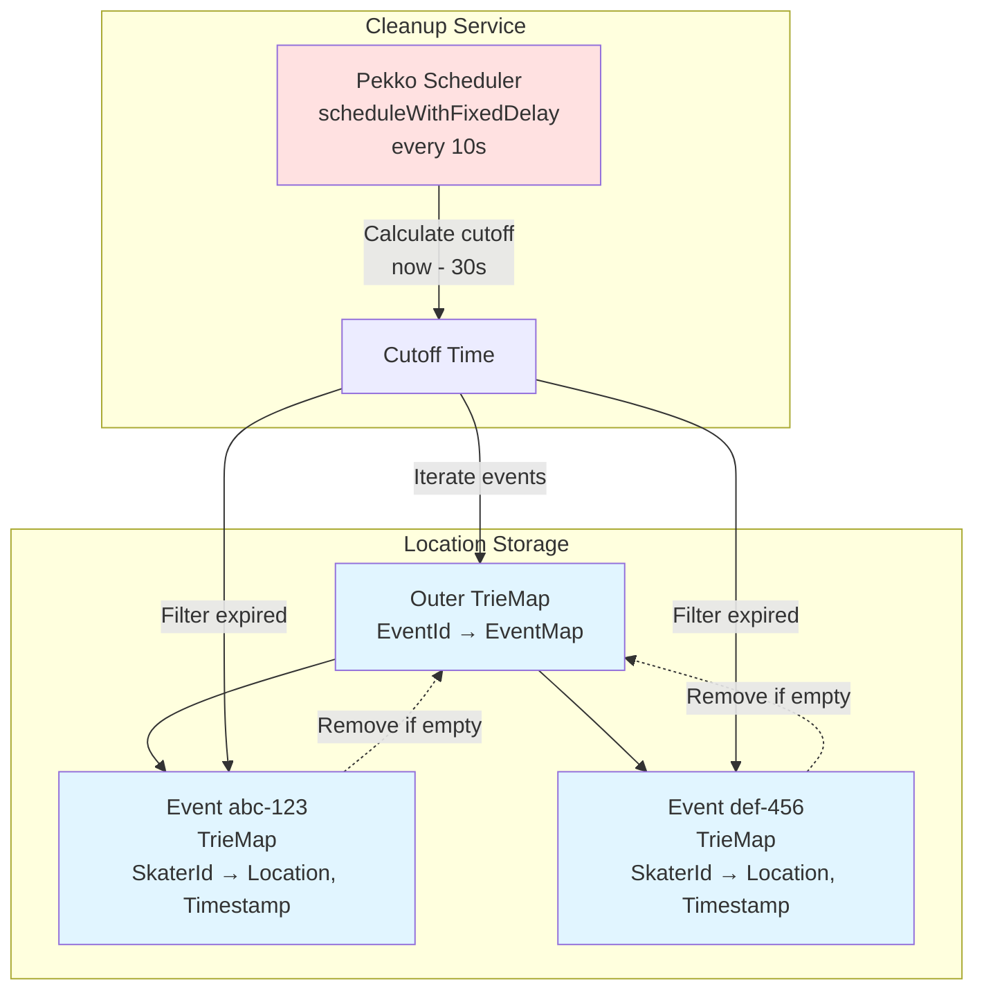
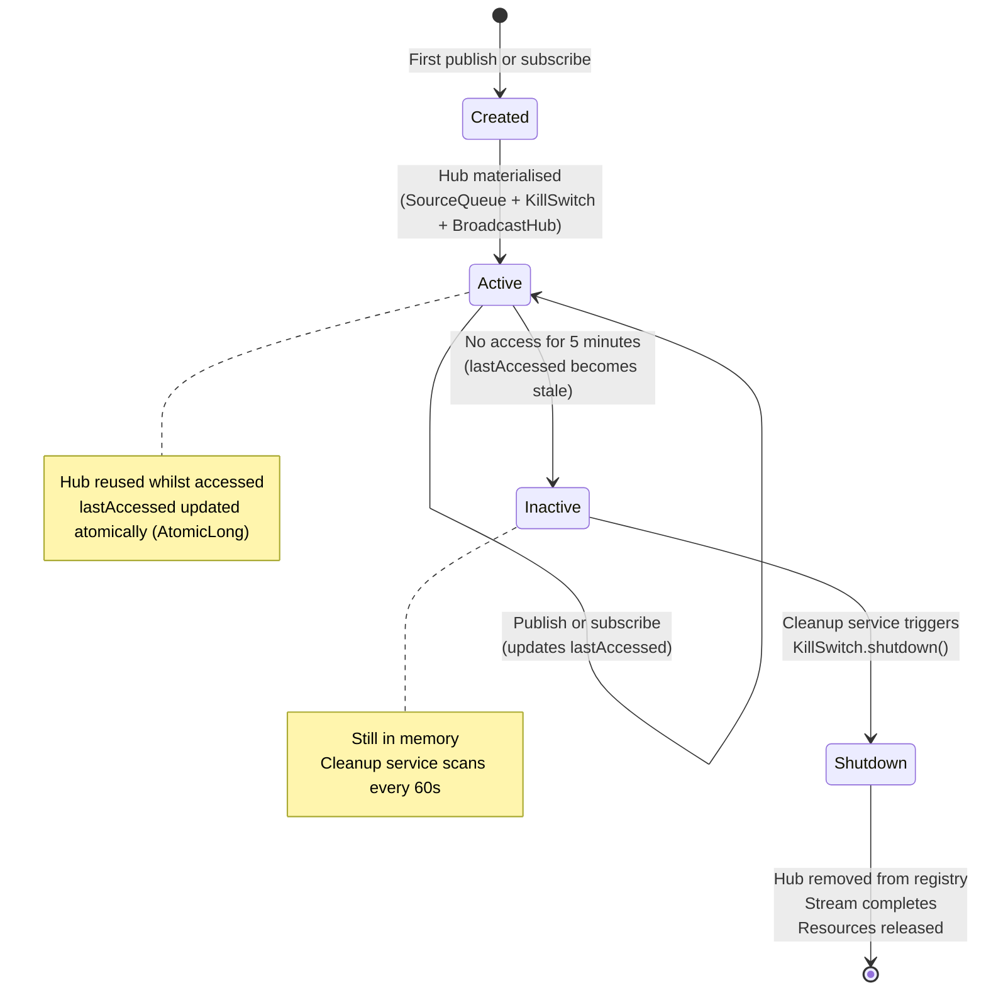

# System Design

## Overview

Skatemap Live is a real-time GPS streaming service for organised skating events. Skaters share their location live so others can join them along the way or track their progress in racing events.

### What It Does

- Event creation (UUID-based, no authentication)
- Location publishing (skaters publish coordinates to events)
- Real-time streaming (viewers receive updates via WebSocket)
- Event isolation (complete data separation between events)

### What It's Designed For

**Design target:** 10-15 concurrent events (realistic Friday night peak across European cities), 10,000-17,000 updates/min

**Tested capacity:** 5 concurrent events, 5,000 updates/min sustained (30-minute load tests)

The system is sized for realistic peak load. Scaling beyond 15 concurrent events would require additional testing and potentially horizontal scaling.

- Per-event capacity: 50-100 skaters publishing every 2-3 seconds
- Latency: p95 <200ms (publish to delivery)
- Deployment: Single Railway instance (512 MB RAM)
- No persistence (ephemeral data, restart = data loss)

## High Level Design

### Data Model

**Event**
- `eventId`: String (UUID format)

**Location**
- `skaterId`: String (UUID format)
- `latitude`: Double (-90 to 90)
- `longitude`: Double (-180 to 180)
- `timestamp`: Long (Unix epoch ms)

### API

**1. Location Publishing**

```
PUT /skatingEvents/{eventId}/skaters/{skaterId}
Content-Type: application/json
```

Request:
```json
{
  "coordinates": [-0.1278, 51.5074]
}
```

Response: `202 Accepted` (empty body)

**2. Stream Consumption**

```
GET /skatingEvents/{eventId}/stream (WebSocket)
```

Response (WebSocket messages):
```json
{
  "locations": [
    {
      "skaterId": "uuid",
      "latitude": 51.5074,
      "longitude": -0.1278,
      "timestamp": 1633024800000
    }
  ],
  "serverTime": 1633024800123
}
```

### Components



- **LocationController**: Validates location data, writes to storage, and publishes to broadcaster
- **StreamController**: Handles WebSocket connections, delegates to EventStreamService
- **EventStreamService**: Reads initial snapshot from store, subscribes to broadcaster for live updates
- **InMemoryLocationStore**: Stores locations in TrieMap structure (Event→Skater→Location)
- **InMemoryBroadcaster**: Maintains one broadcast hub per event. When a location is published, it's queued and broadcast to all active subscribers for that event. Uses Pekko Streams `BroadcastHub` for fan-out
- **CleanupService**: Removes expired locations (30s TTL)
- **BroadcasterCleanupService**: Shuts down inactive broadcast hubs (300s TTL)

## Deep Dives

### Event Isolation

The system must handle multiple skating events simultaneously without any cross-contamination. If Event A has 20 skaters and Event B has 15 skaters, a viewer watching Event A should never receive locations from Event B, even briefly. This isolation requirement applies to both stored data and real-time streams.



The diagram shows conceptual separation; in implementation, both TrieMaps live within a single outer concurrent map partitioned by eventId. This design enforces a key invariant: all ingress and egress paths are keyed by eventId, and no global all-events read or stream exists.

The storage layer uses a nested TrieMap: `TrieMap[String, TrieMap[String, (Location, Instant)]]` where the outer key is eventId and the inner map stores skater locations keyed by skaterId.

Here's the exact flow when LocationController receives a location for Event abc-123. It calls `store.put("abc-123", location)`. The storage layer executes `store.getOrElseUpdate("abc-123", TrieMap.empty)`, which looks up "abc-123" in the outer map. If the event doesn't exist yet (first location for this event), it creates a new empty TrieMap and inserts it. Either way, it returns the event-specific map. Then it calls `eventMap.put(skaterId, (location, timestamp))` to store the location within Event abc-123's map.

When a viewer queries Event abc-123, EventStreamService calls `store.getAll("abc-123")`. The storage layer looks up "abc-123" in the outer map—an O(1) hash lookup. If it exists, it converts the internal TrieMap to an immutable Map snapshot and returns it. This conversion is O(n) where n is the number of skaters in Event abc-123 (not the total number of skaters across all events). If the event doesn't exist, it returns an empty map. The key point: the operation only touches Event abc-123's data, regardless of how many other events exist.

The streaming layer mirrors this structure exactly. The broadcaster maintains `TrieMap[String, HubData]` where each event ID maps to its own `BroadcastHub`. When LocationController publishes to Event abc-123, it calls `broadcaster.publish("abc-123", location)`. The broadcaster executes `hubs.getOrElseUpdate("abc-123", createHub())`, which either retrieves Event abc-123's existing hub or creates a new one. It then offers the location to that hub's queue: `hubData.queue.offer(location)`.

When EventStreamService subscribes to Event abc-123, it calls `broadcaster.subscribe("abc-123")`, which looks up "abc-123" in the hubs map and returns that hub's source. The source is Event abc-123's `BroadcastHub` output—it only broadcasts Event abc-123's locations. Event def-456's locations flow through Event def-456's completely separate hub.

Separate hubs avoid broadcasting irrelevant elements to all subscribers. While filtering could be applied downstream per subscriber (using `source.filter(_.eventId == "abc-123")`), this wastes CPU and bandwidth by pushing elements through the hub only to drop them. It also couples buffer occupancy and scheduling across events. Per-event hubs eliminate this overhead and isolate buffer state.

The benefits of this architecture are concrete. First, read queries scale with event size, not system size. Querying Event abc-123's 50 locations when the system has 10 events costs the same as when it has 100 events. The hash lookup is O(1), and the map conversion is O(50) regardless. Second, events are logically isolated and localise most contention paths within the application. When slow subscribers cause buffer saturation on Event abc-123, buffer pressure and any resulting drops (configured with a dropping overflow strategy, e.g., OverflowStrategy.dropHead) are confined to Event abc-123's hub—Event def-456's queue and subscribers are unaffected. A bug in some other event's data (malformed coordinates, excessive publish rate) cannot directly corrupt Event abc-123's or Event def-456's data structures because event data is partitioned into per-event structures with no cross-event mutation paths. Third, memory reclamation is granular. When Event abc-123's cleanup runs, it removes Event abc-123's locations and potentially Event abc-123's entire entry from the outer map. Event def-456's data is untouched during this process.

The resource independence is particularly valuable during cleanup. The cleanup service scans the outer map and processes each event's data independently, though all events are scanned in sequence. If Event abc-123 has 1,000 expired locations and Event def-456 has 10, Event abc-123's filtering takes longer but the operations don't interfere with each other's data structures or locks.

The trade-off is memory overhead from per-event data structures. Each event requires its own TrieMap for locations and its own HubData for streaming (containing queue, source, kill switch, and timestamp reference). These incur small constant overhead costs before any locations are added.

At target scale (100 concurrent events with 512 MB allocation), this per-event overhead represents a tiny fraction of total memory. Even with many single-skater events, the structural cost is negligible compared to location data and hub buffers. The system trades this fixed, small memory cost for simplified read path logic and better isolation properties.

One subtle benefit: the isolation pattern makes the system's behaviour predictable. When debugging Event abc-123's missing locations, you examine Event abc-123's map and Event abc-123's hub. You don't wade through a shared structure wondering if Event def-456's data is interfering. When testing, you can create isolated test events that don't interact with real events. When monitoring, metrics are naturally per-event—Event abc-123's location count, Event def-456's hub subscriber count—without requiring tag-based filtering.

It's important to note that events are logically isolated, not physically sealed. CPU, garbage collection, and memory pressure are still shared across all events. A pathological Event ghi-789 that creates massive allocation pressure will trigger GC pauses affecting all events. The JVM's heap is shared. But at the application level, the data structures and control flow are partitioned per event, which localises most operational concerns.

### Streaming Topology

Real-time streaming presents a specific challenge: multiple viewers need to receive the same location updates simultaneously without duplicating work. When Skater A publishes a location to Event X, all viewers watching Event X should receive it. When Viewer 1 connects, they shouldn't trigger re-materialisation of the stream. When Viewer 2 disconnects, Viewer 1's stream should continue unaffected.

As discussed in Event Isolation, each event maintains its own independent hub.

The system solves this using Pekko Streams' `BroadcastHub`, which provides a single materialised stream that multiple consumers can attach to.

When the broadcaster materialises the stream for an event, it creates a hub for that event. Hub materialisation occurs lazily on first access: when LocationController calls `publish()` for the first time, or when EventStreamService calls `subscribe()` for the first time. If a hub is later cleaned up and a subsequent publish or subscribe occurs, a new hub is materialised. This hub consists of three components connected in a pipeline: a source queue, a kill switch, and a broadcast hub sink.



The source queue is the write end. When a publisher offers a location, it enters this queue as a buffered element. The queue has a fixed capacity of 128 elements (configurable via application.conf) and uses a drop-head overflow strategy (drop-head discards the oldest buffered element when the queue is full, discussed further in the next section). The queue is materialised once when the hub is created and persists for the hub's lifetime.

The `Source.queue` decouples publishers from subscribers. Backpressure from slow viewers does not propagate upstream because the queue and `BroadcastHub` break the backpressure chain. However, if publishers outpace the queue capacity, elements are dropped at the `Source.queue` boundary according to the configured overflow strategy.

The kill switch sits in the middle of the pipeline. It's a control point that allows graceful shutdown of the entire stream. This is critical for memory management—simply removing a hub from the registry doesn't release the materialised stream graph and its internal resources. The kill switch ensures the stream can be properly terminated.

The broadcast hub is the fan-out mechanism. It receives locations from the queue and broadcasts them to all active subscribers. The hub materialises to a Source object that can be reused by multiple consumers. When EventStreamService calls subscribe, it receives this Source. Play Framework materialises the Source when the WebSocket connection is established, creating a new output stream. The BroadcastHub itself provides no replay mechanism—late subscribers to the hub receive only elements emitted after their subscription. However, EventStreamService addresses this limitation by prepending a snapshot from InMemoryLocationStore before connecting to the live stream (initial ++ updates), ensuring viewers who join late see current state immediately. The BroadcastHub internally tracks all active materialisations and sends each incoming location to all of them.

This topology solves the multi-subscriber problem elegantly. Publishers write to a single queue regardless of subscriber count. The `BroadcastHub` handles fan-out internally without application code managing a list of subscribers. Subscribers can connect and disconnect freely—each materialisation is independent.

The trade-off is lifecycle management complexity. The stream remains materialised and running as long as the upstream is alive, preventing garbage collection because the stream graph is still active. Without the kill switch, materialised hubs that are never explicitly shut down would leak memory indefinitely.

**Critical limitation: Hub cleanup terminates active viewers.** The broadcaster cleanup service monitors inactive hubs and invokes the kill switch after 300 seconds of inactivity. Inactivity is determined solely by a `lastAccessed` timestamp that tracks when publish or subscribe operations last occurred.

Here's why this is problematic: once a viewer subscribes, they passively receive data through the materialised stream. The act of receiving data does not update `lastAccessed`—only explicit publish or subscribe calls do. This means active viewers watching an event do not prevent cleanup. If no new locations are published and no new viewers subscribe for 300 seconds, the hub is cleaned up even if 50 viewers are actively watching. The service invokes the kill switch and removes the hub from the registry, terminating all active connections for that event.

This cleanup policy prioritises memory over connection stability—hubs are shut down based on publish/subscribe activity rather than active viewer count. For events where skaters pause (no new location publishes) but viewers continue watching, all connections will be terminated after 300 seconds. This is a known limitation: the current implementation does not track active subscriber count or distinguish between "unused hub with no viewers" and "active hub with viewers but no recent publishes".

This behavior is acceptable for short-lived events with continuous activity (e.g., races where skaters move constantly and events complete within 30-60 minutes). For such events, the 300-second cleanup threshold is unlikely to trigger. However, it is problematic for long-form events or events where participants take extended breaks, as viewers will be unexpectedly disconnected during pauses in activity.

**Potential mitigations** (not currently implemented):
- Track active subscriber count and exclude hubs with subscribers from cleanup (most robust, but requires custom instrumentation—Pekko Streams does not expose materialisation count, so the Source would need wrapping to track when streams start and complete)
- Send periodic keepalive publishes (empty location updates) to prevent cleanup (simplest workaround, but treats symptom rather than cause)
- Implement viewer-initiated heartbeat mechanism that updates `lastAccessed` (requires client changes and generates additional traffic)
- Use separate cleanup criteria: time since last publish vs. time since last subscriber activity (more complex, but cleanly separates publisher and subscriber concerns)

When a viewer attempts to subscribe to a cleaned-up hub, the broadcaster creates a new hub (lazy materialisation on access). The viewer receives a fresh stream that begins with a snapshot of current locations (from InMemoryLocationStore) concatenated with live updates from the new hub.

### Backpressure Handling

Backpressure is a fundamental challenge in streaming systems. In location streaming, GPS publishers can send updates every few seconds, but a viewer on a slow mobile connection might struggle to keep up. How should the system handle this mismatch?

If downstream backpressure propagates upstream in this topology, a single slow viewer would throttle all publishers and affect all other viewers. In a multi-tenant system with independent events, this violates the isolation requirement.

The system decouples downstream backpressure using a bounded buffer with drop-head overflow strategy. Each event's hub uses `Source.queue` with fixed capacity (128 elements) and `OverflowStrategy.dropHead`, which evicts the head element on overflow. When the queue fills to capacity, each new offer evicts the oldest queued element. Overflow occurs upstream of the `BroadcastHub` fan-out point, so all subscribers receive the same post-drop stream. There are no per-subscriber buffers—when elements are dropped, all subscribers miss the same elements.

For buffer sizing, assume a worst-case aggregate publishing rate of 20 locations per second per event. At this rate, the 128-element buffer represents approximately 6 seconds of data.

When sustained publishing exceeds buffer capacity, the system drops the oldest buffered locations. For real-time GPS tracking, this is acceptable—viewers care more about current positions than complete history. `SourceQueue.offer` is asynchronous and returns `QueueOfferResult`. With `OverflowStrategy.dropHead`, the offer does not block the publisher; older elements are dropped instead of applying backpressure. The publisher proceeds without waiting for downstream demand signals.

The system provides no delivery guarantees, no replay mechanism, and no client-visible signal when drops occur. Clients cannot distinguish network packet loss from buffer overflow.

Drop-head prioritises recency and maintains event isolation. Drop-tail would violate the freshness requirement by discarding new locations. Backpressure would violate isolation by coupling events. Failing would violate availability by terminating the stream.

The buffer size is configured globally via `skatemap.hub.bufferSize` and applied to each event hub instance. Larger buffers increase per-event memory footprint. Smaller buffers reduce tolerance for bursts.


### Location TTL and Cleanup

Without cleanup, long-running events with continuous location updates would accumulate unbounded in-memory state. The system must remove stale location data whilst ensuring new viewers still see current event state.



Location data is ephemeral by design. When a skater publishes their position, that data remains relevant for a short time window—long enough for viewers to see where skaters are now, but not requiring permanent storage. This applies to the real-time location state only; the system includes no database, persistence layer, or backup strategy for location data.

Each location has a time-to-live of 30 seconds (configured via `skatemap.location.ttlSeconds`). This TTL balances two concerns. It must be long enough that viewers joining mid-event see current state—a snapshot of where all skaters are right now. But it must be short enough to prevent memory accumulation from long-running events.

The cleanup mechanism operates via Pekko's `scheduleWithFixedDelay`, running every 10 seconds (configured via `skatemap.cleanup.intervalSeconds`). Each run calculates a cutoff timestamp using wall-clock time (`Clock.instant()`) minus the TTL. Wall-clock adjustments from NTP synchronisation may introduce minor skew in cutoff accuracy. Each run then iterates the outer `TrieMap` containing all events. For each event, it filters the inner `TrieMap` in place, removing entries with timestamps before the cutoff. If an event's location map becomes empty, the entire event entry is removed from the outer map. This iteration and removal is best-effort, not atomic—concurrent writes may occur during cleanup without coordination.

This design enables automatic event lifecycle management. When an event ends and skaters stop publishing, their last locations expire within the TTL window. The cleanup service removes these locations, leaving an empty event map, which is then removed. The system currently relies solely on automatic cleanup; no explicit event deletion API is implemented.

The timing parameters create specific system behaviour. The 10-second cleanup interval means locations can persist up to 40 seconds in the worst case (30-second TTL plus 10-second cleanup delay). Expired locations may be served to new viewers between cleanup runs, as `InMemoryLocationStore.getAll()` does not enforce TTL to avoid per-read filtering overhead.

The trade-off is memory usage approximately bounded by (active skaters × active events × TTL window). Between cleanup runs, expired-but-not-yet-deleted locations consume memory. More frequent cleanup reduces this overhead but increases CPU usage from scanning. The 10-second default interval is designed to prevent unbounded growth whilst avoiding constant scanning. Under CPU or GC pressure, cleanup may lag beyond the configured interval, allowing temporary memory growth within the TTL window.

### Broadcast Hub Lifecycle

Broadcast hubs are created on demand, persist whilst active, and require explicit shutdown when no longer needed. Improper lifecycle management causes memory leaks—the original implementation leaked memory by using `BroadcastHub` with `OverflowStrategy.dropHead` but without attaching `Sink.ignore`, causing messages to accumulate internally when no subscribers were connected.



A hub is created lazily on first access for an event. "Access" means either publishing a location or subscribing to the stream via the broadcaster's `publish()` or `subscribe()` methods. When LocationController publishes to Event A for the first time, it calls the broadcaster's publish method, which checks if a hub exists for Event A via `TrieMap.getOrElseUpdate`. If not, it materialises the stream topology (source queue, kill switch, broadcast hub) and stores the resulting handles in a `HubData` structure. Subsequent publishes and subscribes for Event A reuse this existing hub. This guarantee relies on all publish and subscribe operations routing through the broadcaster's registry; direct stream materialisation would bypass lifecycle management.

Each hub tracks its `lastAccessed` timestamp using an `AtomicLong`. Every publish or subscribe operation updates this timestamp atomically via `Clock.millis()` (meaning publishes prevent hub cleanup even when viewers are disconnected). This timestamp is the basis for determining hub inactivity.

The lifecycle challenge is knowing when to destroy a hub. Unlike locations with their explicit timestamps, stream components don't naturally expire. A materialised stream persists until explicitly shut down. The cleanup mechanism operates via Pekko's `scheduleWithFixedDelay`, running every 60 seconds (configured via `skatemap.hub.cleanupIntervalSeconds`). Each run scans all hubs and identifies those not accessed within the TTL period of 5 minutes (configured via `skatemap.hub.ttlSeconds`). For each inactive hub, the cleanup service calls the kill switch's `shutdown()` method to complete the stream normally, then removes the hub from the `TrieMap` using atomic compare-and-swap semantics (`remove(key, hubData)`) to prevent races with concurrent publish or subscribe operations.

The kill switch is essential because simply removing the hub from the registry doesn't release the underlying Pekko Streams resources. The `BroadcastHub`'s internal stages and materialised graph references remain reachable unless the stream is completed or cancelled; the kill switch provides an explicit, supported shutdown path. When `KillSwitch.shutdown()` is invoked, it completes the stream normally, causing all downstream subscribers to receive a completion signal and disconnect gracefully.

The 5-minute TTL for hubs (configured via `skatemap.hub.ttlSeconds`) is much longer than the 30-second TTL for locations. This asymmetry is deliberate. Location data becomes irrelevant quickly—after 30 seconds, the skater has moved. But the streaming infrastructure should tolerate temporary inactivity. If viewers disconnect briefly (network blip, app background) and reconnect before the hub is cleaned up, they reuse the existing hub provided no locations were published during the gap (otherwise `lastAccessed` would have been updated by the publish operation). This avoids the overhead of repeated hub creation (which involves stream materialisation and actor system resources, not just map insertion).

The cleanup interval of 60 seconds is less frequent than location cleanup (10 seconds). At expected scale (10-15 concurrent events), scan cost is O(n) in active hubs. The 60-second interval limits unnecessary scans whilst ensuring hubs are removed within 6 minutes of becoming inactive (5-minute TTL plus 60-second scan interval).

The main trade-off is the TTL tuning. Longer TTLs keep hubs alive through temporary inactivity, reducing churn. But they also keep unused hubs in memory longer after events genuinely end. The 5-minute setting balances these concerns based on typical European skating event durations of 30-120 minutes, where a 5-minute idle threshold captures genuine event completion rather than brief pauses.
