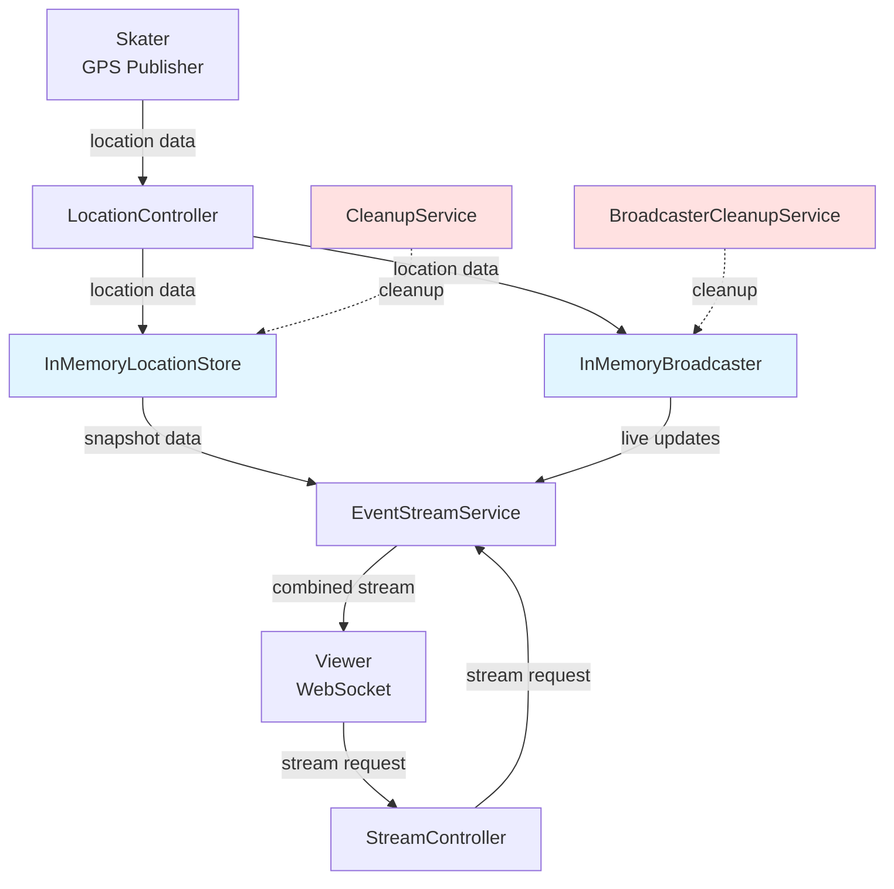
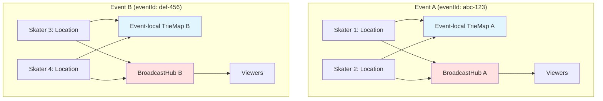
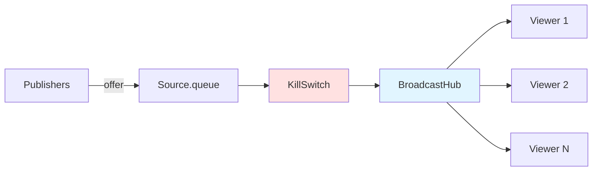
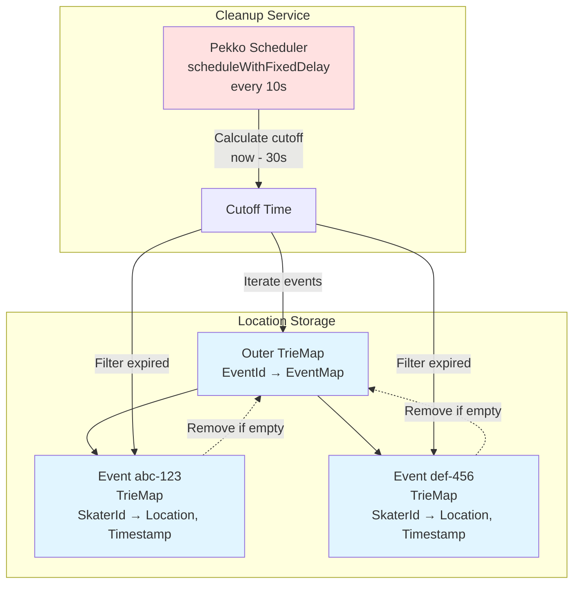
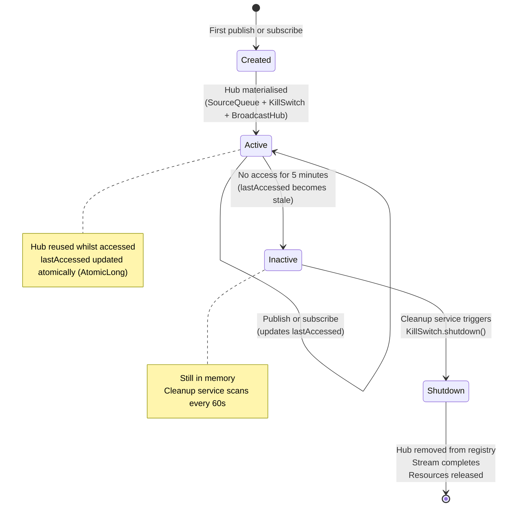
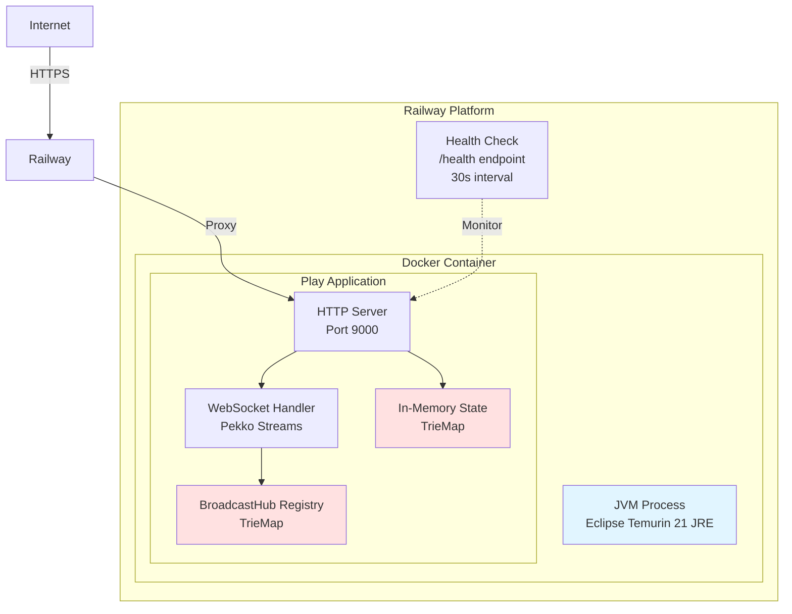

# System Design

## Overview

Skatemap Live is a real-time GPS streaming service for organised skating events. Skaters share their location live so others can join them along the way or track their progress in racing events.

### What It Does

- Event identifiers are client-generated UUIDs; the server creates event state lazily on first publish or subscribe
- Location publishing (skaters publish coordinates to events)
- Real-time streaming (viewers receive updates via WebSocket)
- Event isolation (independent data structures per event; shared JVM runtime)

### What It's Designed For

**Design target:** 10-15 concurrent events (realistic Friday night peak across European cities)

**Tested capacity:** 2 concurrent events, 200 updates/min sustained (30-minute smoke tests)

The system targets a realistic Friday-night peak and has been validated only at the tested capacity described below. Scaling beyond 15 concurrent events would require additional testing and a different architecture (externalised state and multi-instance coordination).

- Design envelope: up to ~50–100 skaters per event publishing every 2–3 seconds (not validated by load tests)
- HTTP request latency: 36.55ms mean (6,880 requests over 34 minutes)
- No persistence (ephemeral data, restart = data loss)

## High Level Design

### Data Model

**Event**
- `eventId`: String (UUID format)

**Location**
- `skaterId`: String (UUID format)
- `latitude`: Double (-90 to 90)
- `longitude`: Double (-180 to 180)
- `timestamp`: Long (Unix epoch ms)

### API

**1. Location Publishing**

```
PUT /skatingEvents/{eventId}/skaters/{skaterId}
Content-Type: application/json
```

Request:
```json
{
  "coordinates": [-0.1278, 51.5074]
}
```

Array format: `[longitude, latitude]` (GeoJSON convention)

Response: `202 Accepted` (empty body)

**2. Stream Consumption**

```
GET /skatingEvents/{eventId}/stream (WebSocket)
```

Response (WebSocket messages):
```json
{
  "locations": [
    {
      "skaterId": "uuid",
      "latitude": 51.5074,
      "longitude": -0.1278,
      "timestamp": 1633024800000
    }
  ],
  "serverTime": 1633024800123
}
```

**3. Event Lifecycle**

Events are created implicitly—no explicit creation endpoint exists. When a client publishes a location to an event ID that doesn't exist, or when a viewer subscribes to a non-existent event, the system creates the necessary data structures lazily. Event cleanup occurs automatically when all locations expire and the broadcast hub is removed (see Deep Dives).

### Components



#### Request Handling

**LocationController** validates incoming location data, writes it to storage, and publishes to the broadcaster. This controller handles the HTTP PUT endpoint for location updates and returns 202 Accepted responses.

**StreamController** handles WebSocket connection requests and delegates stream management to EventStreamService.

#### Data Storage and Broadcasting

**InMemoryLocationStore** stores locations using a nested TrieMap structure (Event→Skater→Location), providing concurrent access with O(1) event lookup. The store retains only the latest location per skater.

**InMemoryBroadcaster** maintains one broadcast hub per event. When a location is published, it's queued in a bounded buffer (128 messages) and broadcast to all active subscribers via Pekko Streams BroadcastHub. This architecture provides fan-out without per-subscriber stream materialisation overhead.

**EventStreamService** combines historical and live data for viewers. It reads an initial snapshot from InMemoryLocationStore, then subscribes to InMemoryBroadcaster for real-time updates, concatenating them into a single stream (initial ++ updates).

#### Background Maintenance

**CleanupService** removes expired locations (30-second TTL) by scanning all events every 10 seconds.

**BroadcasterCleanupService** shuts down inactive broadcast hubs (300-second TTL) by scanning every 60 seconds and invoking kill switches on unused hubs.

## Deep Dives

### Event Isolation

The system must handle multiple skating events simultaneously without any cross-contamination. If Event A has 20 skaters and Event B has 15 skaters, a viewer watching Event A should never receive locations from Event B, even briefly. This isolation requirement applies to both stored data and real-time streams.



The diagram shows conceptual separation; in implementation, both TrieMaps live within a single outer concurrent map partitioned by eventId. This design enforces a key invariant: all ingress and egress paths are keyed by eventId, and no global all-events read or stream exists.

The storage layer uses a nested TrieMap: `TrieMap[String, TrieMap[String, (Location, Instant)]]` where the outer key is eventId and the inner map stores skater locations keyed by skaterId.

Here's the exact flow when LocationController receives a location for Event abc-123. It calls `store.put("abc-123", location)`. The storage layer executes `store.getOrElseUpdate("abc-123", TrieMap.empty)`, which looks up "abc-123" in the outer map. If the event doesn't exist yet (first location for this event), it creates a new empty TrieMap and inserts it. Either way, it returns the event-specific map. Then it calls `eventMap.put(skaterId, (location, timestamp))` to store the location within Event abc-123's map.

When a viewer queries Event abc-123, EventStreamService calls `store.getAll("abc-123")`. The storage layer looks up "abc-123" in the outer map—an O(1) hash lookup. If it exists, it converts the internal TrieMap to an immutable Map snapshot and returns it. This conversion is O(n) where n is the number of skaters in Event abc-123 (not the total number of skaters across all events). If the event doesn't exist, it returns an empty map. The key point: the operation only touches Event abc-123's data, regardless of how many other events exist.

The streaming layer mirrors this structure exactly. The broadcaster maintains `TrieMap[String, HubData]` where each event ID maps to its own `BroadcastHub`. When LocationController publishes to Event abc-123, it calls `broadcaster.publish("abc-123", location)`. The broadcaster executes `hubs.getOrElseUpdate("abc-123", createHub())`, which either retrieves Event abc-123's existing hub or creates a new one. It then offers the location to that hub's queue: `hubData.queue.offer(location)`.

When EventStreamService subscribes to Event abc-123, it calls `broadcaster.subscribe("abc-123")`, which looks up "abc-123" in the hubs map and returns that hub's source. The source is Event abc-123's `BroadcastHub` output—it only broadcasts Event abc-123's locations. Event def-456's locations flow through Event def-456's completely separate hub.

We chose per-event hubs to avoid wasting resources on filtering. While we could use a single global hub and filter by eventId downstream (using `source.filter(_.eventId == "abc-123")`), this would waste CPU and bandwidth by pushing irrelevant elements through the hub only to drop them. It would also couple buffer occupancy and scheduling across events—slow subscribers on Event abc-123 would affect Event def-456's queue state. Per-event hubs eliminate this overhead and isolate buffer state.

The benefits of this architecture are concrete. First, read queries scale with event size, not system size. Querying Event abc-123's 50 locations when the system has 10 events costs the same as when it has 100 events. The hash lookup is O(1), and the map conversion is O(50) regardless. Second, events are logically isolated and localise most contention paths within the application. When slow subscribers cause buffer saturation on Event abc-123, buffer pressure and any resulting drops (configured with a dropping overflow strategy, e.g., OverflowStrategy.dropHead) are confined to Event abc-123's hub—Event def-456's queue and subscribers are unaffected. A bug in one event is less likely to affect another event's data because state and streams are partitioned by eventId. Third, memory reclamation is granular. When Event abc-123's cleanup runs, it removes Event abc-123's locations and potentially Event abc-123's entire entry from the outer map. Event def-456's data is untouched during this process.

The resource independence is particularly valuable during cleanup. The cleanup service scans the outer map and processes each event's data independently, though all events are scanned in sequence. If Event abc-123 has 1,000 expired locations and Event def-456 has 10, Event abc-123's filtering takes longer but the operations don't interfere with each other's data structures or locks.

The trade-off is memory overhead from per-event data structures. Each event requires its own TrieMap for locations and its own HubData for streaming (containing queue, source, kill switch, and timestamp reference). These incur small constant overhead costs before any locations are added.

Per-event structures add fixed overhead. The practical memory limit depends on heap sizing, viewer count, and publish rates—none of which have been characterised beyond the documented tests. The system trades per-event structural overhead for simplified read path logic and better isolation properties.

One subtle benefit: the isolation pattern makes the system's behaviour predictable. When debugging Event abc-123's missing locations, you examine Event abc-123's map and Event abc-123's hub. You don't wade through a shared structure wondering if Event def-456's data is interfering. When testing, you can create isolated test events that don't interact with real events. When monitoring, metrics are naturally per-event—Event abc-123's location count, Event def-456's hub subscriber count—without requiring tag-based filtering.

It's important to note that events are logically isolated, not physically sealed. While CPU, garbage collection, and memory pressure are shared across all events at the JVM level, the application-level data structures and control flow are partitioned per event, which localises most operational concerns.

### Streaming Topology

Real-time streaming presents a specific challenge: multiple viewers need to receive the same location updates simultaneously without duplicating work. When Skater A publishes a location to Event X, all viewers watching Event X should receive it. When Viewer 1 connects, they shouldn't trigger re-materialisation of the stream. When Viewer 2 disconnects, Viewer 1's stream should continue unaffected.

As discussed in Event Isolation, each event maintains its own independent hub.

The system solves this using Pekko Streams' `BroadcastHub`, which provides a single materialised stream that multiple consumers can attach to.

When the broadcaster materialises the stream for an event, it creates a hub for that event. Hub materialisation occurs lazily on first access: when LocationController calls `publish()` for the first time, or when EventStreamService calls `subscribe()` for the first time. If a hub is later cleaned up and a subsequent publish or subscribe occurs, a new hub is materialised. This hub consists of three components connected in a pipeline: a source queue, a kill switch, and a broadcast hub sink.



The source queue is the write end. When a publisher offers a location, it enters this queue as a buffered element. The queue has a fixed capacity of 128 elements (configurable via application.conf) and uses a drop-head overflow strategy (drop-head discards the oldest buffered element when the queue is full, discussed further in the next section). The queue is materialised once when the hub is created and persists for the hub's lifetime.

The `Source.queue` decouples publishers from subscribers. Backpressure from slow viewers does not propagate upstream because the queue and `BroadcastHub` break the backpressure chain. However, if publishers outpace the queue capacity, elements are dropped at the `Source.queue` boundary according to the configured overflow strategy.

The kill switch sits in the middle of the pipeline. It's a control point that allows graceful shutdown of the entire stream. This is critical for memory management—simply removing a hub from the registry doesn't release the materialised stream graph and its internal resources. The kill switch ensures the stream can be properly terminated.

The broadcast hub is the fan-out mechanism. It receives locations from the queue and broadcasts them to all active subscribers. The hub materialises to a Source object that can be reused by multiple consumers. When EventStreamService calls subscribe, it receives this Source. Play Framework materialises the Source when the WebSocket connection is established, creating a new output stream. The BroadcastHub itself provides no replay mechanism—late subscribers to the hub receive only elements emitted after their subscription. However, EventStreamService addresses this limitation by prepending a snapshot from InMemoryLocationStore before connecting to the live stream (initial ++ updates), ensuring viewers who join late see current state immediately. The BroadcastHub internally tracks all active materialisations and sends each incoming location to all of them.

This topology solves the multi-subscriber problem elegantly. Publishers write to a single queue regardless of subscriber count. The `BroadcastHub` handles fan-out internally without application code managing a list of subscribers. Subscribers can connect and disconnect freely—each materialisation is independent.

The trade-off is lifecycle management complexity. The stream remains materialised and running as long as the upstream is alive, preventing garbage collection because the stream graph is still active. Without the kill switch, materialised hubs that are never explicitly shut down would leak memory indefinitely.

**Critical limitation: Hub cleanup terminates active viewers.** The broadcaster cleanup service monitors inactive hubs and invokes the kill switch after 300 seconds of inactivity. Inactivity is determined solely by a `lastAccessed` timestamp that tracks when publish or subscribe operations last occurred.

Here's why this is problematic: once a viewer subscribes, they passively receive data through the materialised stream. The act of receiving data does not update `lastAccessed`—only explicit publish or subscribe calls do. This means active viewers watching an event do not prevent cleanup. If no new locations are published and no new viewers subscribe for 300 seconds, the hub is cleaned up even if 50 viewers are actively watching. The service invokes the kill switch and removes the hub from the registry, terminating all active connections for that event.

This cleanup policy prioritises memory over connection stability—hubs are shut down based on publish/subscribe activity rather than active viewer count. For events where skaters pause (no new location publishes) but viewers continue watching, all connections will be terminated after 300 seconds. This is a known limitation: the current implementation does not track active subscriber count or distinguish between "unused hub with no viewers" and "active hub with viewers but no recent publishes".

This disconnects viewers during publish inactivity. Whether that behaviour is acceptable depends on event characteristics—it suits short races with continuous movement but not long-form events where participants pause.

**Potential mitigations** (not currently implemented):
- Track active subscriber count and exclude hubs with subscribers from cleanup (most robust, but requires custom instrumentation—Pekko Streams does not expose materialisation count, so the Source would need wrapping to track when streams start and complete)
- Send periodic keepalive publishes (empty location updates) to prevent cleanup (simplest workaround, but treats symptom rather than cause)
- Implement viewer-initiated heartbeat mechanism that updates `lastAccessed` (requires client changes and generates additional traffic)
- Use separate cleanup criteria: time since last publish vs. time since last subscriber activity (more complex, but cleanly separates publisher and subscriber concerns)

When a viewer attempts to subscribe to a cleaned-up hub, the broadcaster creates a new hub (lazy materialisation on access). The viewer receives a fresh stream that begins with a snapshot of current locations (from InMemoryLocationStore) concatenated with live updates from the new hub.

### Backpressure Handling

Backpressure is a fundamental challenge in streaming systems. In location streaming, GPS publishers can send updates every few seconds, but a viewer on a slow mobile connection might struggle to keep up. How should the system handle this mismatch?

If downstream backpressure propagates upstream in this topology, a single slow viewer would throttle all publishers and affect all other viewers. In a multi-tenant system with independent events, this violates the isolation requirement.

The system decouples downstream backpressure using a bounded buffer with drop-head overflow strategy. Each event's hub uses `Source.queue` with fixed capacity (128 elements) and `OverflowStrategy.dropHead`, which evicts the head element on overflow. When the queue fills to capacity, each new offer evicts the oldest queued element. Overflow occurs upstream of the `BroadcastHub` fan-out point, so all subscribers receive the same post-drop stream. There are no application-managed per-subscriber buffers in the hub path; lower layers (Pekko HTTP, TCP) may still buffer frames. When elements overflow at the hub queue, all subscribers receive the same post-drop stream.

For buffer sizing, we use a design assumption (not measured in production) of ~20 locations per second per event as a worst-case aggregate publishing rate. At this rate, the 128-element buffer represents approximately 6 seconds of data.

When sustained publishing exceeds buffer capacity, the system drops the oldest buffered locations. For real-time GPS tracking, this is acceptable—viewers care more about current positions than complete history. `SourceQueue.offer` is asynchronous and returns `QueueOfferResult`. With `OverflowStrategy.dropHead`, the offer does not block the publisher; older elements are dropped instead of applying backpressure. The publisher proceeds without waiting for downstream demand signals.

The system provides no delivery guarantees, no replay mechanism, and no client-visible signal when drops occur. Clients cannot distinguish network packet loss from buffer overflow.

Drop-head prioritises recency and maintains event isolation. Drop-tail would violate the freshness requirement by discarding new locations. Backpressure would violate isolation by coupling events. Failing would violate availability by terminating the stream.

The buffer size is configured globally via `skatemap.hub.bufferSize` and applied to each event hub instance. Larger buffers increase per-event memory footprint. Smaller buffers reduce tolerance for bursts.


### Location TTL and Cleanup

Without cleanup, long-running events with continuous location updates would accumulate unbounded in-memory state. The system must remove stale location data whilst ensuring new viewers still see current event state.



Location data is ephemeral by design. When a skater publishes their position, that data remains relevant for a short time window—long enough for viewers to see where skaters are now, but not requiring permanent storage. This applies to the real-time location state only; the system includes no database, persistence layer, or backup strategy for location data.

Each location has a time-to-live of 30 seconds (configured via `skatemap.location.ttlSeconds`). This TTL balances two concerns. It must be long enough that viewers joining mid-event see current state—a snapshot of where all skaters are right now. But it must be short enough to prevent memory accumulation from long-running events.

The cleanup mechanism operates via Pekko's `scheduleWithFixedDelay`, running every 10 seconds (configured via `skatemap.cleanup.intervalSeconds`). Each run calculates a cutoff timestamp using wall-clock time (`Clock.instant()`) minus the TTL. Wall-clock adjustments from NTP synchronisation may introduce minor skew in cutoff accuracy. Each run then iterates the outer `TrieMap` containing all events. For each event, it filters the inner `TrieMap` in place, removing entries with timestamps before the cutoff. If an event's location map becomes empty, the entire event entry is removed from the outer map. This iteration and removal is best-effort, not atomic—concurrent writes may occur during cleanup without coordination.

This design enables automatic event lifecycle management. When an event ends and skaters stop publishing, their last locations expire within the TTL window. The cleanup service removes these locations, leaving an empty event map, which is then removed. The system currently relies solely on automatic cleanup; no explicit event deletion API is implemented.

The timing parameters create specific system behaviour. The 10-second cleanup interval means locations can persist up to 40 seconds in the worst case (30-second TTL plus 10-second cleanup delay). Expired locations may be served to new viewers between cleanup runs, as `InMemoryLocationStore.getAll()` does not currently enforce TTL at read time.

The trade-off is memory usage approximately bounded by (active skaters × active events × TTL window). Between cleanup runs, expired-but-not-yet-deleted locations consume memory. More frequent cleanup reduces this overhead but increases CPU usage from scanning. The 10-second default interval is designed to prevent unbounded growth whilst avoiding constant scanning. Under CPU or GC pressure, cleanup may lag beyond the configured interval, allowing temporary memory growth within the TTL window.

### Broadcast Hub Lifecycle

Broadcast hubs are created on demand, persist whilst active, and require explicit shutdown when no longer needed. Improper lifecycle management causes memory leaks—the original implementation leaked memory by using `BroadcastHub` with `OverflowStrategy.dropHead` but without attaching `Sink.ignore`, causing messages to accumulate internally when no subscribers were connected.



A hub is created lazily on first access for an event. "Access" means either publishing a location or subscribing to the stream via the broadcaster's `publish()` or `subscribe()` methods. When LocationController publishes to Event A for the first time, it calls the broadcaster's publish method, which checks if a hub exists for Event A via `TrieMap.getOrElseUpdate`. If not, it materialises the stream topology (source queue, kill switch, broadcast hub) and stores the resulting handles in a `HubData` structure. Subsequent publishes and subscribes for Event A reuse this existing hub. This guarantee relies on all publish and subscribe operations routing through the broadcaster's registry; direct stream materialisation would bypass lifecycle management.

Each hub tracks its `lastAccessed` timestamp using an `AtomicLong`. Every publish or subscribe operation updates this timestamp atomically via `Clock.millis()` (meaning publishes prevent hub cleanup even when viewers are disconnected). This timestamp is the basis for determining hub inactivity.

The lifecycle challenge is knowing when to destroy a hub. Unlike locations with their explicit timestamps, stream components don't naturally expire. A materialised stream persists until explicitly shut down. The cleanup mechanism operates via Pekko's `scheduleWithFixedDelay`, running every 60 seconds (configured via `skatemap.hub.cleanupIntervalSeconds`). Each run scans all hubs and identifies those not accessed within the TTL period of 5 minutes (configured via `skatemap.hub.ttlSeconds`). For each inactive hub, the cleanup service calls the kill switch's `shutdown()` method to complete the stream normally, then removes the hub from the `TrieMap` using conditional removal (`remove(key, hubData)`) to reduce the risk of races with concurrent publish or subscribe operations.

The kill switch is essential because simply removing the hub from the registry doesn't release the underlying Pekko Streams resources. The `BroadcastHub`'s internal stages and materialised graph references remain reachable unless the stream is completed or cancelled; the kill switch provides an explicit, supported shutdown path. When `KillSwitch.shutdown()` is invoked, it completes the stream normally, causing all downstream subscribers to receive a completion signal. WebSocket closure behaviour depends on the server and client implementation—clients may experience either graceful completion or abrupt disconnection depending on their WebSocket handling.

The 5-minute TTL for hubs (configured via `skatemap.hub.ttlSeconds`) is much longer than the 30-second TTL for locations. This asymmetry is deliberate. Location data becomes irrelevant quickly—after 30 seconds, the skater has moved. But the streaming infrastructure should tolerate temporary inactivity. If viewers disconnect briefly (network blip, app background) and reconnect before the hub is cleaned up, they reuse the existing hub provided no locations were published during the gap (otherwise `lastAccessed` would have been updated by the publish operation). This avoids the overhead of repeated hub creation (which involves stream materialisation and actor system resources, not just map insertion).

The cleanup interval of 60 seconds is less frequent than location cleanup (10 seconds). At expected scale (10-15 concurrent events), scan cost is O(n) in active hubs. The 60-second interval limits unnecessary scans whilst ensuring hubs are removed within 6 minutes of becoming inactive (5-minute TTL plus 60-second scan interval).

The main trade-off is the TTL tuning. Longer TTLs keep hubs alive through temporary inactivity, reducing churn. But they also keep unused hubs in memory longer after events genuinely end. The 5-minute setting balances these concerns based on typical European skating event durations of 30-120 minutes, where a 5-minute idle threshold captures genuine event completion rather than brief pauses.

## Deployment

### Single-Instance Architecture

The system runs as a single JVM instance on Railway PaaS. This deployment model stems directly from the in-memory state design—the TrieMap-based location store and BroadcastHub registry exist only within one process. Multiple instances would require distributed state coordination (Redis Pub/Sub or similar), which adds latency and operational complexity unnecessary for a demonstration system targeting 10-15 concurrent events.



The single-instance constraint has direct implications. Vertical scaling is the only option—larger instance types provide more memory and CPU, but throughput remains bounded by a single JVM process. Restart or crash causes complete data loss, as all location state and broadcast hubs exist only in heap memory. There is no write-ahead log, no replication, and no recovery mechanism.

The system has no external dependencies—no database, message queue, or cache layer. All state exists within the JVM process.

Railway provisions 512 MB RAM and shared vCPU on the free tier. Heap sizing is not explicitly configured, allowing the JVM to use default sizing based on the container's memory allocation.

### Infrastructure Requirements

**JVM Version:** Eclipse Temurin 21 (LTS release), running on Linux x86_64. The Dockerfile explicitly pins `eclipse-temurin:21-jre` for the runtime image, ensuring consistent behaviour across local development and production deployment.

**Memory Allocation:**
- **Total RAM:** 512 MB (Railway platform allocation)
- **JVM heap:** Default sizing (not explicitly configured; typically ~50-60% of container memory on modern JVMs)

**Memory Scaling Estimation:**

The following are rough estimates based on heap dump analysis during profiling (not production measurements):

The location store retains only the latest location per skater. Memory scales primarily with (active skaters × active events) plus per-event hub buffers:

- Location data per skater: ~48 bytes estimated (coordinate pair + timestamp)
- Hub buffer per event: Queue (128 × ~48 bytes) + BroadcastHub overhead ≈ 8 KB estimated
- Per-event structural overhead: ~32 KB estimated (TrieMap + HubData + kill switch)

At target scale (15 events, ~50 skaters per event, ~150 viewers):
- Location data: 15 × 50 × 48 bytes ≈ 36 KB
- Hub buffers: 15 × 8 KB ≈ 120 KB
- Event structures: 15 × 32 KB ≈ 480 KB
- WebSocket overhead: ~150 × 10 KB ≈ 1.5 MB estimated
- JVM baseline: Observed 63-67 MB during single-event local profiling (heap configuration undocumented)

These estimates show substantial headroom within the allocated memory, but actual memory consumption depends on GC behaviour, allocation patterns, and workload characteristics that have not been characterised at target scale.

**CPU:** Shared vCPU on Railway (no guaranteed allocation). Cleanup scans iterate all events sequentially every 10 seconds. Per-run scan cost is O(events × skaters), independent of publish rate in terms of scan cardinality—more events increase cleanup work, but higher update frequency does not increase the number of items scanned per cleanup run. Pekko Streams uses internal thread pools for asynchronous operations (materialised graphs, WebSocket frame processing).

**Ports:**
- `9000`: HTTP and WebSocket traffic (Play Framework default, overridable via `PORT` environment variable)
- Health checks: Railway platform polls `/health` endpoint every 30 seconds with 3-second timeout

**Network:** Railway provides HTTPS termination automatically. The application listens on HTTP within the container; Railway's proxy handles TLS.

### Configuration Management

Configuration follows a layered approach: defaults in `application.conf`, overridable via environment variables. This supports local development (defaults) and production deployment (Railway environment variables) without code changes.

**Configuration Structure:**

```
application.conf (defaults)
├── play.server.http.port = 9000
│   └── ${?PORT} override
├── pekko.http.server.idle-timeout = 3 minutes
│   └── ${?WEBSOCKET_IDLE_TIMEOUT} override
└── skatemap.*
    ├── cleanup.*
    │   ├── initialDelaySeconds = 10
    │   │   └── ${?CLEANUP_INITIAL_DELAY_SECONDS}
    │   └── intervalSeconds = 10
    │       └── ${?CLEANUP_INTERVAL_SECONDS}
    ├── location.*
    │   └── ttlSeconds = 30
    │       └── ${?LOCATION_TTL_SECONDS}
    ├── stream.*
    │   ├── batchSize = 100
    │   │   └── ${?STREAM_BATCH_SIZE}
    │   └── batchIntervalMillis = 500
    │       └── ${?STREAM_BATCH_INTERVAL_MILLIS}
    └── hub.*
        ├── ttlSeconds = 300
        │   └── ${?HUB_TTL_SECONDS}
        ├── cleanupIntervalSeconds = 60
        │   └── ${?HUB_CLEANUP_INTERVAL_SECONDS}
        └── bufferSize = 128
            └── ${?HUB_BUFFER_SIZE}
```

**Note:** BroadcasterCleanupService initial delay equals `cleanupIntervalSeconds` (same value, not separately configurable).

**Key Settings:**

| Setting | Default | Override Env Var | Purpose |
|---------|---------|------------------|---------|
| `play.server.http.port` | 9000 | `PORT` | HTTP server listening port |
| `pekko.http.server.idle-timeout` | 3 minutes | `WEBSOCKET_IDLE_TIMEOUT` | WebSocket connection timeout (no activity) |
| `skatemap.location.ttlSeconds` | 30 | `LOCATION_TTL_SECONDS` | Location expiry window |
| `skatemap.cleanup.intervalSeconds` | 10 | `CLEANUP_INTERVAL_SECONDS` | Location cleanup frequency |
| `skatemap.hub.ttlSeconds` | 300 | `HUB_TTL_SECONDS` | BroadcastHub idle expiry (5 minutes) |
| `skatemap.hub.cleanupIntervalSeconds` | 60 | `HUB_CLEANUP_INTERVAL_SECONDS` | Hub cleanup scan frequency |
| `skatemap.hub.bufferSize` | 128 | `HUB_BUFFER_SIZE` | Messages buffered per hub |
| `skatemap.stream.batchSize` | 100 | `STREAM_BATCH_SIZE` | Max locations per WebSocket batch |
| `skatemap.stream.batchIntervalMillis` | 500 | `STREAM_BATCH_INTERVAL_MILLIS` | Max time between batches |

**Configuration Validation:** The `skatemap.*` configuration values are validated at application startup via `SkatemapLiveModule.getPositiveInt()`. Missing required settings or non-positive values (for TTLs, intervals, buffer sizes) cause immediate startup failure with clear error messages. This fail-fast approach prevents misconfiguration from reaching production. The `/health` endpoint is implemented by `HealthController` (route: `GET /health skatemap.api.HealthController.health` in `conf/routes`) and returns 200 OK when the application is fully initialised.

**Railway Environment Variables:**
Railway injects `PORT` automatically (dynamically assigned). All other settings use defaults from `application.conf` unless explicitly overridden in Railway's service settings panel.

### Packaging and Deployment Process

The application is packaged as a Docker image using a multi-stage build defined in `services/api/Dockerfile.railway`. Railway automatically builds and deploys this image when changes are pushed to the connected Git branch.

**Build Process (Stage 1: Builder):**

1. **Base image:** `eclipse-temurin:21-jdk` provides Java Development Kit for compilation
2. **SBT installation:** Downloads SBT 1.11.5 from official releases, installs to `/usr/local/sbt`
3. **Dependency caching:** Railway's build system caches `/root/.sbt`, `/root/.ivy2`, `/root/.cache/coursier` between builds
4. **Source compilation:** Copies project files (build definitions, source code, configuration) and runs `sbt stage`, which:
   - Resolves dependencies (Scala 2.13.16, Play Framework, Pekko Streams)
   - Compiles source files with scalac
   - Packages application into `target/universal/stage` directory structure

**Runtime Process (Stage 2: Production):**

1. **Base image:** `eclipse-temurin:21-jre` provides Java Runtime Environment only (smaller image, no compiler overhead)
2. **Non-root user:** Creates `skatemap` user and group, runs application with dropped privileges (security hardening)
3. **Artifact copy:** Copies staged application from builder image (`/app/target/universal/stage`)
4. **Entrypoint script:** `docker-entrypoint.sh` starts the application without additional JVM options (uses JVM defaults)
5. **Health check:** Docker HEALTHCHECK directive polls `http://localhost:9000/health` every 30 seconds (interval), 3-second timeout, 3 retries before marking unhealthy

**Deployment Trigger:**

Railway watches the configured Git branch (`master` for production). On push:
1. Clones repository
2. Builds Docker image using `railway.toml` configuration (`dockerfilePath: services/api/Dockerfile.railway`)
3. Runs health check (polls `/health` with 100-second timeout, configured in `railway.toml`)
4. If health check passes: stops old container, starts new container (no true zero-downtime on Railway free tier)
5. If health check fails: aborts deployment, keeps old container running

**Deployment Downtime:** Railway performs container replacement (stop then start) with downtime. In-memory state is lost. All active WebSocket connections drop, all location data is lost. Clients must reconnect and republish locations. This downtime is inherent to the single-instance, in-memory design—even with a more sophisticated platform, deployments would still cause state loss unless distributed state coordination were added. This is acceptable for a demonstration system at this scale but problematic for production deployment.

### Operational Considerations

**Startup Sequence:**

1. JVM initialises (loads classes, initialises heap)
2. Play Framework starts HTTP server on port 9000
3. Dependency injection wires components (`SkatemapLiveModule` binds `InMemoryLocationStore`, `InMemoryBroadcaster`, cleanup services)
4. Pekko ActorSystem initialises (thread pools, schedulers)
5. Cleanup services schedule background tasks:
   - `CleanupService`: schedules with 10-second initial delay, 10-second interval
   - `BroadcasterCleanupService`: schedules with 60-second initial delay, 60-second interval
6. `/health` endpoint becomes available (returns `200 OK` when application ready)

**Typical startup time:** 15-20 seconds (observed during development on Railway). Health check allows 40 seconds before marking unhealthy (`start-period=40s` in Dockerfile).

**Shutdown Sequence:**

1. Railway sends `SIGTERM` to container
2. Play Framework receives shutdown hook, stops accepting new connections
3. In-flight HTTP requests allowed to complete (grace period: short, platform-defined, typically ~10 seconds)
4. Pekko ActorSystem shutdown begins:
   - Cleanup schedulers cancelled
   - Active streams receive completion signal (WebSocket connections close gracefully)
   - BroadcastHub kill switches invoked (streams terminate)
5. JVM exits

**Graceful shutdown limitation:** The grace period may not be sufficient for long-running WebSocket connections to drain cleanly. Active viewers experience abrupt disconnection rather than clean closure. This stems from both Railway's platform grace period and the application's lack of staged shutdown (no rejection of new WebSocket upgrades, no client signalling, no coordinated hub termination before forced closure).

**Monitoring Surface:**

Railway provides basic observability:
- **Logs:** `stdout`/`stderr` from JVM captured by Railway's log aggregation (viewable in dashboard, not persisted long-term on free tier). Logback outputs text-formatted logs (timestamp, level, logger name, message)
- **Metrics:** CPU usage (%), memory usage (MB), network I/O (bytes/sec) — visible in Railway dashboard
- **Health checks:** `/health` endpoint polls (success/failure history)

**Missing observability:**
- No distributed tracing (no correlation IDs across requests)
- No Prometheus metrics export (event count, location count, hub count not exposed)
- No alerting (Railway free tier lacks alerting integrations)

**GC and Heap Dumps:**

The JVM is configured for profiling and post-mortem analysis:
- **GC logs:** Written to `gc-<timestamp>.log` in container filesystem (ephemeral, lost on restart)
- **Heap dumps:** Generated automatically on `OutOfMemoryError`, written to `./heap-dumps/` directory

These files exist only within the container and are lost on restart. To retrieve them for analysis, use Railway CLI:

```bash
# Example workflow (best-effort; requires PID discoverability and sufficient container permissions, not guaranteed on all PaaS configurations)
railway run jcmd <pid> GC.heap_dump /tmp/heap.hprof
railway run cat /tmp/heap.hprof > local-heap.hprof
```

This workflow is manual and cumbersome. Production deployment would require persistent volume mounts or automatic upload to object storage (S3, GCS).

**Crash Behaviour:**

If the JVM crashes (uncaught exception, `OutOfMemoryError`, segmentation fault):
1. Container exits with non-zero status
2. Railway automatically restarts container (restart policy: always)
3. Application starts fresh
4. Clients must reconnect and republish

**Recovery Time Objective (RTO):** Typically 20-30 seconds (startup time). No manual intervention required.

## Observability

### Current Observability State

The system provides minimal observability. Logging, health checks, and post-mortem debugging tools exist, but application-level metrics, distributed tracing, and structured logging do not.

**Logging:** The application uses Logback configured to write text-formatted logs to stdout and stderr. Railway's log aggregation captures these streams and makes them viewable in the dashboard, though logs are not persisted long-term on the free tier. The cleanup services emit informational logs: CleanupService logs "Location cleanup completed: removed X locations from Y events" and BroadcasterCleanupService logs "Hub cleanup completed: removed X hubs" on each run. These messages confirm that background processes are executing but provide no timing information or performance metrics.

GC logging and heap dumps are configured in build.sbt for local development profiling (`-Xlog:gc*=debug:file=gc-%t.log`, `-XX:+HeapDumpOnOutOfMemoryError`, `-XX:HeapDumpPath=./heap-dumps/`). These JVM options apply when running via `sbt run` but are not carried over to the Railway Docker deployment, where the application runs with JVM defaults.

**Platform Metrics:** Railway provides CPU usage (percentage), memory usage (megabytes), and network I/O (bytes per second). These metrics show resource consumption at the container level but offer no insight into application behaviour—event count, location count, WebSocket connections, or hub activity remain invisible.

**Health Endpoint:** The `/health` endpoint returns 200 OK with no body. It performs no readiness checks—does not verify cleanup services, memory headroom, or hub state. Railway uses it for deployment health checks.

**Post-Mortem Tools:** When OutOfMemoryError occurs, a heap dump is generated automatically. Manual heap dumps can be triggered via `jcmd <pid> GC.heap_dump` for investigating performance or memory issues. These dumps are analysed offline. Both heap dumps and GC logs exist only within the container's ephemeral filesystem—they must be retrieved using Railway CLI before the container is replaced or restarted.

### Operational Visibility

The current observability state supports basic operational questions but cannot answer most runtime queries about application behaviour.

**What can be answered:**
- Has the application started successfully?
- Are cleanup services running?
- Is memory or CPU trending upwards?
- Did a crash occur?

**What cannot be answered:**
- How many events are currently active?
- How many locations are in memory per event?
- How many WebSocket connections are active per event?
- How many broadcast hubs exist?
- What is the location publish rate?
- What is the p95 latency from publish to WebSocket delivery?

This gap became operationally significant during memory leak investigations. Issues [#138](https://github.com/SkatemapApp/skatemap-live/issues/138), [#142](https://github.com/SkatemapApp/skatemap-live/issues/142), [#166](https://github.com/SkatemapApp/skatemap-live/issues/166), and [#171](https://github.com/SkatemapApp/skatemap-live/issues/171) required heap dump analysis to detect memory growth trends because no runtime metrics existed. Had event count, location count, and hub count been exposed as metrics, memory leaks would have been detectable by observing these counters growing without bound rather than requiring offline heap dump comparison.

### Design Tradeoff: Simplicity Over Instrumentation

The minimal observability approach aligns with the demonstration system's design goals documented in [ADR 0001](../adr/0001-railway-platform-choice.md), which prioritised delivery speed over production-grade instrumentation for a single-process system with no distributed components.

This tradeoff created friction during memory leak debugging. The three iterations required to achieve stable memory (MergeHub → Source.queue → Source.queue + KillSwitch + Sink.ignore) each involved Railway deployment, heap dump capture and offline analysis. Had runtime metrics exposed hub count and location count, the first iteration's memory leak would have been immediately visible as unbounded growth in these counters during load testing.

### Missing Capabilities

The system lacks application-level metrics, distributed tracing, structured logging, and alerting.

**No application metrics:** The application exposes no metrics endpoint. Event count, location count per event, active WebSocket connections, hub count, publish rate, stream throughput, and cleanup duration are not instrumented. Observing these values requires heap dumps or code modification to add logging.

**No distributed tracing:** Requests have no identifiers linking related operations. A location publish request handled by `LocationController` cannot be traced to its broadcast through `InMemoryBroadcaster` and delivery via WebSocket by `EventStreamService`. Logs from these components appear independently.

**No structured logging:** Logs are text-formatted, designed for human reading rather than machine parsing. Finding all logs related to a specific event requires text search rather than field-based filtering.

**No alerting:** The system provides no proactive notifications. Memory trending towards exhaustion, cleanup falling behind publish rate, or WebSocket connections failing to close do not trigger alerts. Railway's free tier does not support alerting integrations. Detection relies on manual observation—checking Railway's dashboard for memory growth, inspecting logs for error messages, or noticing application unavailability.

## Performance Characteristics

### Throughput and Latency

HTTP request latency for location publishing has been measured during load testing. Analysis of 6,880 location update requests over a 34-minute period with 10 concurrent skaters showed response times ranging from 15.51ms (minimum) to 403.70ms (maximum), with a mean of 36.55ms. These measurements represent the time from HTTP request submission to receiving the acknowledgement response from the server.

End-to-end latency—the time from location publication to WebSocket delivery to viewers—has not been systematically measured. The load testing infrastructure includes viewer simulation capabilities with reception timestamp recording, but WebSocket latency data has not been successfully collected in documented test runs.

Throughput testing has focused on correctness and stability rather than maximum capacity. Smoke tests exercise 2 concurrent events with 5 skaters each, generating approximately 200 location updates per minute sustained over 30 minutes. The system handled this load without request failures, with stable memory consumption throughout the test duration. Testing beyond this scale has not been performed, so throughput at higher concurrency levels has not been tested.

### Resource Usage

Memory consumption during a 30-minute load test with a single event and 10 concurrent skaters publishing every 3 seconds showed heap usage between 63 MB and 67 MB. These measurements were obtained from heap dumps taken at 10-minute intervals during local profiling using Eclipse MAT. During a subsequent 20-minute idle period following the load test, heap usage decreased to 63.2 MB, showing heap reduction after the load test concluded.

The application runs in a container with 512 MB total memory allocation. Heap sizing is not explicitly configured in the build or deployment scripts. The JVM uses default sizing based on the container's 512 MB memory allocation. The heap configuration used during local profiling that produced the 63-67 MB measurements has not been documented.

Railway platform metrics provide visibility into container-level CPU and memory usage during deployed operation. CPU utilisation during load tests was not systematically recorded from Railway metrics.

Memory growth characteristics were investigated during work on Issues #138, #142, #166, and #171. Heap dump analysis identified and resolved a memory leak caused by per-publish stream materialisation. Post-fix profiling confirmed stable memory usage with no accumulation of stream interpreter instances during sustained load.

### Scalability Limits

The single-JVM process architecture imposes a hard constraint on horizontal scalability. In-memory state (TrieMap-based location storage and BroadcastHub registry) exists only within one process, preventing distribution across multiple instances without introducing external coordination infrastructure.

The single-container architecture constrains the system to Railway's per-container resource limits. The current configuration allocates 512 MB total memory and uses Pekko's default dispatcher configuration, which provides a fork-join executor pool sized according to available CPU cores. Thread pool and dispatcher configurations have not been tuned beyond framework defaults.

Load testing has covered two scenarios: a 30-minute smoke test with 2 concurrent events (5 skaters each, 200 updates/minute total), and a 34-minute single-event test with 10 concurrent skaters (200 updates/minute). The system targets 10-15 concurrent events as documented in ADR 0001. This design target has not been validated through testing. Behaviour at higher event concurrency, higher per-event skater counts, or higher aggregate throughput has not been characterised.

### Performance Bottlenecks

Cleanup operations impose computational cost proportional to the number of events and skaters in memory. The location cleanup service iterates through all events and all skaters per event every 10 seconds (configured via `skatemap.cleanup.intervalSeconds`), removing locations older than 30 seconds (configured via `skatemap.location.ttlSeconds`). Similarly, the broadcast hub cleanup service scans all hubs every 60 seconds, removing those unused for 300 seconds. Per-run scan cost is O(events × skaters). Higher publish rates can still increase allocation and GC pressure, but do not increase the number of items scanned per cleanup run. Location cleanup must visit every skater in every event; hub cleanup must visit every hub.

TrieMap access patterns for location storage and retrieval introduce lock-free concurrent access overhead, though specific profiling of TrieMap contention has not been performed. The in-memory storage design means working set size grows linearly with the number of active events and skaters, bounded only by the location TTL and hub TTL settings.

WebSocket broadcast is implemented via Pekko Streams BroadcastHub with a configured buffer size of 128 messages per hub (`skatemap.hub.bufferSize`). When the buffer fills due to slow consumers or no consumers, the oldest buffered locations are dropped (`OverflowStrategy.dropHead`). Buffer overflow behaviour has been observed during profiling when subscribers disconnect but publishers continue—the configured buffer fills and locations are dropped according to the configured overflow strategy. This overflow strategy prioritises recent locations over buffering for slow consumers.

The batch size and interval for WebSocket message delivery are configured at 100 locations (`skatemap.stream.batchSize`) with a maximum 500ms delay (`skatemap.stream.batchIntervalMillis`). These values have not been tuned based on latency or throughput measurements.
